# Documentation / Report

# Project Report: Privileged Access Management (PAM) and Admin Bastion

# 1. Introduction

In modern IT environments, Privileged Access Management (PAM) has become a critical security measure to protect organizations from internal and external cyber threats. PAM refers to the tools and processes used to manage, monitor, and control access to accounts with elevated permissions—typically administrator or root-level accounts. These privileged accounts are a prime target for attackers, as they can grant unrestricted access to sensitive systems and data if compromised.

To further enhance control over access, many organizations deploy a secure access point known as an **Admin Bastion**. While this project explored the concept of an Admin Bastion, our implementation relied on **ManageEngine PAM360’s built-in proxy and remote session management capabilities** to serve the same purpose. PAM360 enabled secure access to critical systems without exposing credentials or allowing direct connections, effectively functioning as a logical bastion host.

The goal of this project is to design, configure, and test a Privileged Access Management lab using PAM360 and demonstrate various real-world use cases. The lab includes infrastructure components such as Active Directory, target servers, and test clients in an Azure-based environment. Through this setup, we aim to showcase how PAM solutions help organizations monitor, detect, and prevent unauthorized privileged access to critical systems—ultimately reducing the risk of credential theft and privilege abuse.

# 2. Background and Motivation

## 2.1 Context

Privileged accounts—such as system administrators, database admins, and cloud root users—have elevated access rights that, if misused or compromised, can cause severe damage to an organization’s infrastructure, data, and reputation. In recent years, many high-profile breaches have been traced back to poor management of privileged credentials, including the use of static passwords, lack of session oversight, and insufficient access controls.

Traditional tools like Active Directory (AD) provide basic identity and access management but fall short when it comes to controlling, auditing, and protecting privileged access. For example, AD does not natively rotate administrator passwords, enforce Just-in-Time (JIT) access, or record privileged sessions.

This gap leaves organizations vulnerable to common attack techniques such as:

- **Credential dumping** (e.g., using tools like Mimikatz to extract passwords from memory)
- **Pass-the-Hash** attacks, where attackers use stolen NTLM hashes to authenticate without knowing passwords
- **Golden Ticket** attacks that forge Kerberos tickets to impersonate users
- **Shadow Admins**, or hidden accounts with excessive privileges that bypass standard oversight

## 2.2 Some privileged access incidents

### 2.2.1 **Uber Admin Credential Compromise in 2022**

[https://www.dnv.com/cyber/insights/articles/frontline-insights-lessons-from-the-uber-2022-data-breach/](https://www.dnv.com/cyber/insights/articles/frontline-insights-lessons-from-the-uber-2022-data-breach/)

[https://techcrunch.com/2022/09/19/how-to-fix-another-uber-breach/](https://techcrunch.com/2022/09/19/how-to-fix-another-uber-breach/)

In 2022, a hacker successfully breached Uber's systems by stealing employee credentials using password-stealing malware combined with social engineering techniques. To bypass Multi-Factor Authentication (MFA), the attacker employed a method known as **MFA fatigue**. This tactic exploits the routine of employees frequently logging in and re-authenticating during their workday. The attacker bombarded the targeted employee with repeated MFA push notifications—often outside of working hours—hoping the victim would eventually approve a login request out of frustration or confusion.

Once access was granted, the attacker gained entry to Uber’s internal network. While scanning the intranet, they discovered PowerShell scripts containing **hardcoded administrator credentials** for a Privileged Access Management (PAM) solution. These credentials provided access to Uber's cloud infrastructure.

Fortunately for Uber, the attacker appeared to not be motivated by financial gain—no ransom was reported, and the breach seemed intended to demonstrate the system’s vulnerabilities rather than actually exploit them.

Below is a scheme from the attack, provided by DNV Cyber :

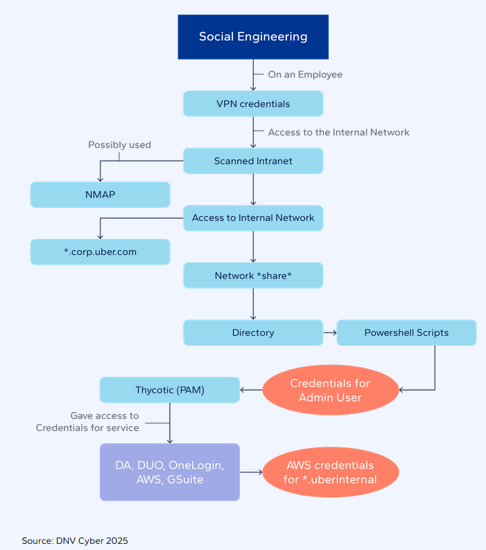

This incident showcases the danger of hardcoded credentials, over-privileged user access and the fact that even MFA can be bypassed with targeted social engineering.

### 2.2.2 Tesla Data Leak in 2023

[https://thecyberexpress.com/former-tesla-employees-tesla-data-leak/](https://thecyberexpress.com/former-tesla-employees-tesla-data-leak/)

[https://tribune.com.pk/story/2535182/what-is-dogequest](https://tribune.com.pk/story/2535182/what-is-dogequest)

Two former Tesla employees leaked over **100 GB of sensitive information** affecting more than **75,000 individuals**. The compromised data included personally identifiable information such as names, Social Security numbers, bank details, and even **in-car recordings of customers**.

According to Tesla’s breach notification, *"a foreign media outlet informed Tesla that it had obtained confidential company information."* The two employees are believed to have misappropriated this data by unlawfully sharing it with the media. While the exact methods remain unclear, the breach **could likely have been prevented through stricter access controls** on databases and the user accounts tied to them.

In an unrelated but equally concerning event, Tesla was reportedly targeted again in **2025**. A website named **"DogeQuest"** surfaced, displaying a large volume of personal data linked to Tesla users via an **interactive map** of the U.S. Tesla vehicle fleet. Although the source of this second breach is still unknown, it underscores a critical reality: **cyberattacks can come from anywhere and often without warning**.

These incidents collectively highlight the importance of **robust data governance**, **access management**, and **ongoing monitoring** to protect against both insider threats and external attacks.

### 2.2.3 **Dropbox Sign Service Account Breach in 2024**

[https://www.kiteworks.com/cybersecurity-risk-management/dropbox-sign-breach/](https://www.kiteworks.com/cybersecurity-risk-management/dropbox-sign-breach/)

[https://sign.dropbox.com/blog/a-recent-security-incident-involving-dropbox-sign](https://sign.dropbox.com/blog/a-recent-security-incident-involving-dropbox-sign)

[https://www.filecloud.com/blog/2024/07/when-giants-fall-the-lessons-from-the-dropbox-data-breach/](https://www.filecloud.com/blog/2024/07/when-giants-fall-the-lessons-from-the-dropbox-data-breach/)

In April 2024, Dropbox disclosed a security breach affecting Dropbox Sign (formerly HelloSign), its e-signature service. According to a blog post by the company : “Upon further investigation, we discovered that a threat actor had accessed data including Dropbox Sign customer information such as emails, usernames, phone numbers and hashed passwords, in addition to general account settings and certain authentication information such as API keys, OAuth tokens, and multi-factor authentication”

The breach was traced back to unauthorized access to the back end of the Dropbox Sign production environment. Although Dropbox Sign operates on a separate infrastructure from Dropbox’s core services, it handles legally binding documents, making the incident quite serious.

The attacker gained entry through an automated system configuration tool, which acted as a gateway into the production environment. This ultimately allowed access to:

- Personally identifiable information (PII)
- Hashed passwords
- API keys and OAuth tokens
- MFA-related data

The inclusion of sensitive authentication data like API keys and OAuth tokens significantly increased the risk of further cross-platform exploitation—especially for partner systems that rely on integrations with Dropbox Sign.

This incident underscores the importance of proactive security governance, especially for services that handle legal and identity-sensitive data. It also serves as a reminder that automation and convenience must always be balanced with strong access controls and vigilant monitoring.

## 2.3 Our motivation

The motivation for this project is to address these security risks by implementing a modern PAM solution that:

- Eliminates permanent privileged access
- Replaces static credentials with dynamic, short-lived secrets
- Enforces strong authentication (e.g., MFA)
- Enables full session recording and auditing
- Centralizes credential management for critical assets like VMs and databases

By deploying and testing **ManageEngine PAM360**, we aim to demonstrate how such a solution can strengthen privileged access controls and reduce the overall attack surface in cloud-based and hybrid environments.

# 3. Solution Overview

### 3.1 ManageEngine PAM360

This project uses **ManageEngine PAM360** as the core platform to demonstrate privileged access management in a cloud-based lab environment.

**ManageEngine** is the enterprise IT management division of **Zoho Corporation**, a privately held, multinational technology company founded in 1996 by Sridhar Vembu and Tony Thomas. Headquartered in Chennai, India, with a global presence including offices in the United States, Zoho specializes in developing software solutions for businesses of all sizes. ManageEngine focuses on providing comprehensive IT management tools, serving companies in 190 countries.
[factsheet.pdf](https://download.manageengine.com/pdf/factsheet.pdf)

A member of our group secured a license for **ManageEngine PAM360**, prompting us to select this solution for our Proof of Concept (PoC). According to Gartner, ManageEngine is recognized as a Challenger in the 2024 Magic Quadrant™ for Privileged Access Management, highlighting its viability for our PoC .

](images/image%201.png)

[ManageEngine named a Challenger in the 2024 Gartner® Magic Quadrant™ for Privileged Access Management | ManageEngine PAM360](https://www.manageengine.com/privileged-access-management/analyst-opinion/gartner-magic-quadrant-pam.html?new-homepage)

Upon installation, PAM360 is described as:

> "A web-based privileged access management (PAM) solution that helps enterprises regulate access to critical IT assets and mitigate risks of privilege misuse and insider threats. Through powerful privileged access governance, smoother workflow automation, advanced analytics, and contextual integrations with various IT services, PAM360 enables enterprises to bring different avenues of their IT management system together, facilitating holistic privileged access security, meaningful inferences, and quicker remedies."
> 

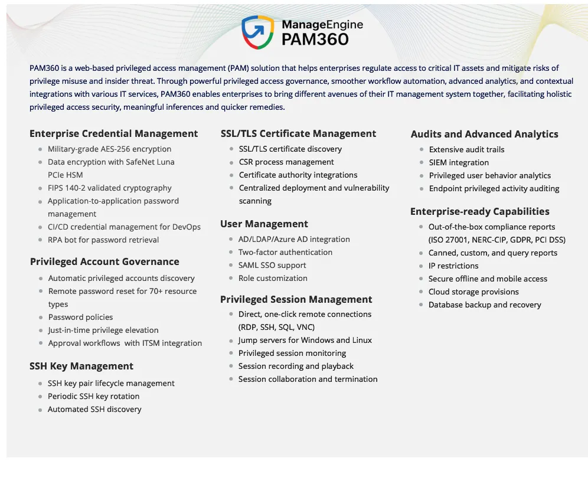

### **Standouts features for us**

- **Unified PAM Platform**: Combines credential management, session management, key/certificate management, and compliance reporting in one platform.
- **DevOps and RPA Integration**: Native CI/CD credential management and support for RPA bots, offering deep automation compatibility.
- **Comprehensive Certificate Management**: Full lifecycle SSL/TLS certificate management with CA integrations.
- **Automated Compliance Reporting**: Out-of-the-box templates for major standards (ISO 27001, GDPR, PCI DSS, NERC-CIP) facilitate regulatory alignment.
- **Session Collaboration**: Real-time session collaboration and termination capabilities enhance control over active privileged sessions.
- **Integrated Discovery**: Automated discovery for SSH keys, certificates, and privileged accounts ensures full visibility.
- **Ease of Deployment**: User-friendly interface and quick setup make it suitable for teams with limited IT resources.

### 3.2 Open Source Alternative - JumpServer

We also evaluated **JumpServer**, an open-source alternative, during the initial research phase. We wanted to find an open-source PAM tool that is free to use, and this solution was the closest that we could get.

JumpServer, developed by **Fit2Cloud,** is an Alternative to one of the leaders in the market, CyberArk. It runs on a Linux Server and can then be accessed on the web


Here are some features offered by this tool : 

- **Multi-Protocol Support**
    - **SSH, RDP, VNC, Telnet**: Facilitates secure connections to various systems.
    - **Kubernetes, SFTP, Databases**: Supports access to container environments and databases.
    - **RemoteApp & Web Applications**: Enables access to web-based applications without additional plugins
- **Web-Based Access**
    - Provides a browser-based interface, eliminating the need for client installations
    - Supports session recording, command auditing, and real-time monitoring
- **Authentication & Authorization**
    - **Integration with AD/LDAP**: Allows centralized user management
    - **Two-Factor Authentication (2FA)**: Enhances security using TOTP (e.g., Google Authenticator)
    - **Role-Based Access Control (RBAC)**: Defines user permissions based on roles
- **Session Management & Auditing**
    - Records sessions for SSH, RDP, and database access.
    - Monitors user activities, including keystrokes and commands executed.
    - Provides detailed audit logs for compliance and analysis.
- **Asset Management**
    - Supports high-availability (HA) cluster deployments.
    - Allows geo-distributed installations and cloud deployments.
    - Integrates with external storage solutions like S3, Ceph, and Azure for storing session recordings.

JumpServer offers two main editions :

- **Community Edition**
    - **License**: Free and open-source.
    - **Users**: Unlimited.
    - **Target Systems**: Supports up to 5,000.
    - **Features**: Includes core PAM functionalities suitable for small to medium-sized organizations.
- **Enterprise Edition**
    - **License**: Paid, based on the number of target systems.
    - **Users**: Unlimited.
    - **Target Systems**: Options for 50, 500, 5,000, or unlimited.
    - **Features**: Offers advanced features like asset synchronization, account backup, password change scheduler, and ticket management.

Although JumpServer offers multi-protocol support, session auditing, and 2FA, we chose PAM360 for the PoC due to its more complete enterprise features, polished user interface, and the fact that a group member secured a license.

https://jumpserver.org/index-en.html

---

# 4. Lab Architecture

### 4.1 Environment

Our lab was built using Microsoft Azure, leveraging its scalable infrastructure and ease of resource provisioning.

### 4.2 Components

The lab setup includes the following components:

| **Component**                    | **Role**                                                                                                                    |
| -------------------------------- | --------------------------------------------------------------------------------------------------------------------------- |
| **PAM360 Server**                | Central management console for privileged access, credential vault, session monitoring, and Zero Trust enforcement          |
| **Active Directory Server**      | Centralized identity management system used for user authentication, group policies, and AD-integrated login scenarios      |
| **Windows 10 Client VM**         | Simulates end-user scenarios such as RDP access, password requests, and session recording                                   |
| **Ubuntu Linux VM**              | Demonstrates SSH-based access control, command restriction, and key-based authentication                                    |
| **Test Users (Windows & Linux)** | Created via PowerShell and added to AD, used to simulate roles like administrators, power users, and standard users         |
| **Azure SQL Server & Database**  | Represents a cloud-hosted data resource secured via PAM360, with session auditing and password rotation capabilities        |
| **Azure Web App (TOTP Demo)**    | A demo application used to showcase TOTP integration with PAM360 for secure authentication and form autofill                |
| **VPN Gateway (Azure)**          | Provides secure remote access to the virtual network hosting PAM360, enabling controlled external connections to lab assets |


### 4.3 Network Design

All components were deployed within a single Azure Virtual Network (VNet) segmented using subnets for isolation:

- Subnet A: Management Layer – PAM360

- Subnet B: Resource Layer – AD, Linux and Windows VMs

Network Security Groups (NSGs) were configured to tightly control traffic between subnets, only allowing required ports (e.g., RDP 3389, SSH 22, HTTP 80/8282, SQL 1433). VPN access has also been set up on the Management Layer. This allows user to connect from their local on PAM360, but not directly into the resources. You must go through PAM360 to access them.

### 4.3 Visual Architecture from our lab

Add architecture image here

### 4.4 Visual Architecture Template from ManageEngine


This diagram shows how users interact with PAM360 to access remote systems while traffic is monitored and routed securely through the PAM360 server, which acts as a central point of control and audit.

---

# 5. Installation and Configuration

This section documents the setup of our privileged access management lab using **ManageEngine PAM360**, hosted in a cloud-based environment on Microsoft Azure. The goal was to establish a secure infrastructure where privileged credentials, remote access, and session activity are centrally managed and monitored.

## 5.1 Infrastructure Setup on Azure

1. Create a dedicated resource group in Azure to manage all resources for this PAM360 environment.
2. Set up a VNet with two subnets:
    - **Subnet 1**: For hosting PAM360 (Windows Server)
    - **Subnet 2**: For your test resources (e.g., Windows 10, Ubuntu VMs)

**Azure VNet Help**: [Create and Manage Virtual Networks](https://learn.microsoft.com/en-us/azure/virtual-network/manage-virtual-network)

An example configuration:


1. Create the following VMs, assigning them to the appropriate subnet:
    - **PAM360 Server** (Windows Server) – Hosts the PAM360 application.
        - Recommended: Standard D4s_v3, 16GB RAM and 100GB SSD (minimum 8 GB RAM and adequate storage)
    - **Windows 10 Client VM** – Used to test RDP access and local user credential management.
        - Recommended: Minimal specs sufficient
        - Create multiple user accounts for testing
    - **Ubuntu VM** – Used to test SSH-based access control.
        - Recommended: Minimal specs sufficient

<aside>

**Important**: When creating VMs, ensure to:

- Attach them to the VNet you configured
- Set up Network Security Group (NSG) rules as shown below:
    
    
    
</aside>

## 5.2 Installing PAM360 on the Windows Server

🔗 **Official Installation Reference**: [ManageEngine PAM360 Installation Guide](https://www.manageengine.com/privileged-access-management/help/installation.html)

1. **Download Installer** from the [ManageEngine website](https://www.manageengine.com/privileged-access-management/).
2. **Run Installer** and and follow the on-screen instructions.
3. **Choose the Installation Type**: 
    - Select “High Availability – Primary Server” setup.
    - Use "Read-Only Server" only for end-users or secondary setups.

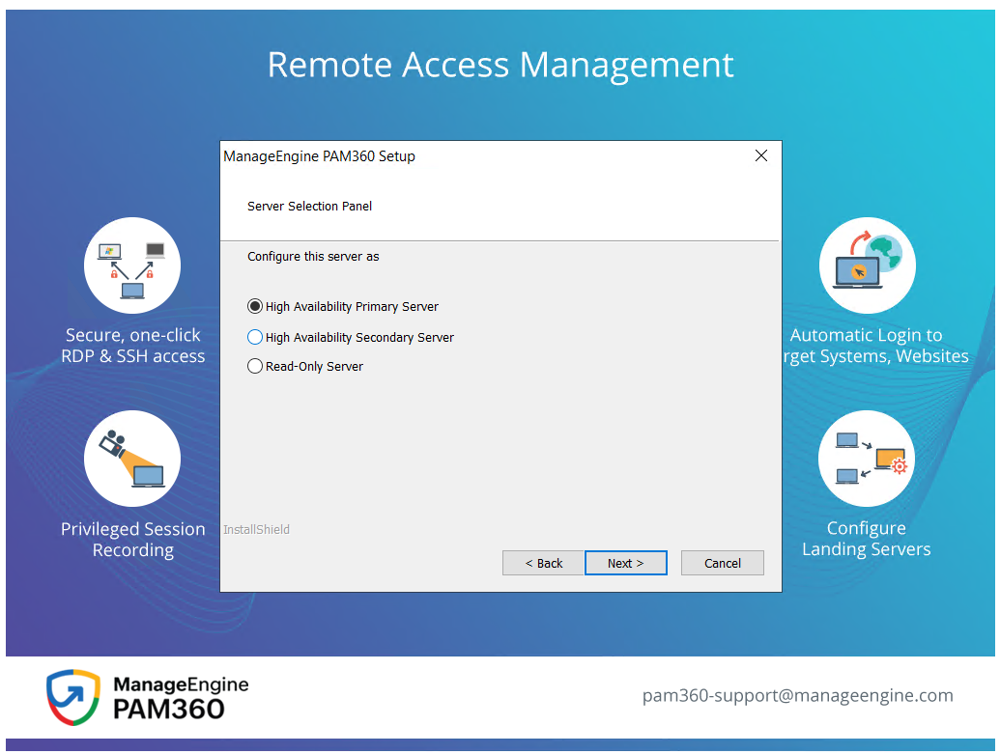

1. **Access the Web UI** via `http://localhost:8282` and log in with default credentials (`admin` / `admin`).

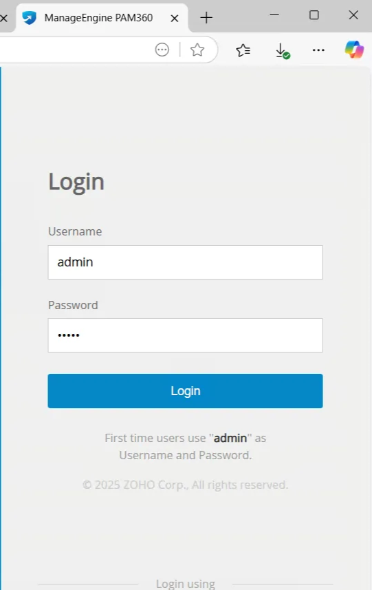

1. **Change Default Password** and update admin contact information.

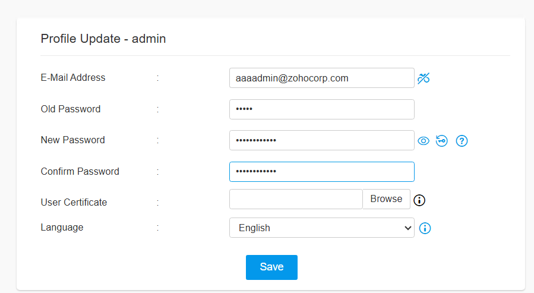

## 5.3 Configuring Email Notifications (SMTP)

To enable email alerts for password changes, user creation, etc., configure the SMTP settings :

1. Go to **Admin** → **Mail Server Settings**

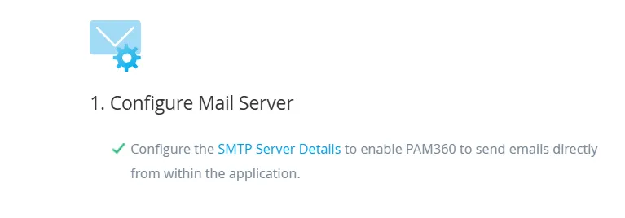

1. For our PoC we created a Gmail account and generated an **App Password**.
    - Create a Gmail account
    - Navigate to **Google Account** → **Security** → **App Passwords**
    - Generate an app password for "PAM360"
2. Configure **SMTP settings** in PAM360:
    - Server: `smtp.gmail.com`
    - Port: `587`
    - **Sender Email**: your Gmail address
    - **Access URL**: `https://PAM:8282`
    - **Authentication**: Enable and set manually
    - **Username / Password**: your Gmail + app password
    - **Protocol**: `TLS`

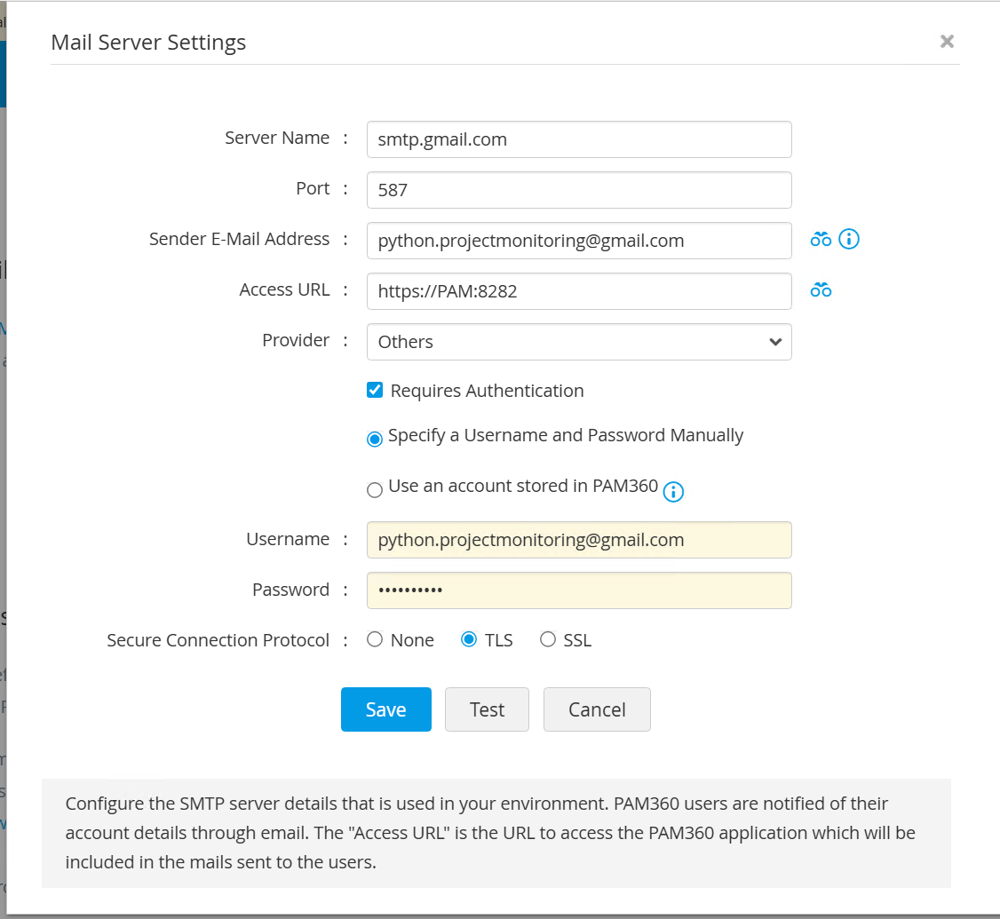

## 5.4 Adding Azure Virtual Machines as Resources

### **5.4.1 Windows 10 VM**:

1. Go to **Resources → Add → Add Resource Manually**
2. Fill in:
    - **Resource Name**: `VMWindows`
    - **IP Address**: IP of your Windows 10 VM
    - **Type**: Windows


1. Add a user account manually using the credentials you defined during VM creation.


1. Click **Discover Accounts** to automatically fetch all users from the VM using the added admin credentials.

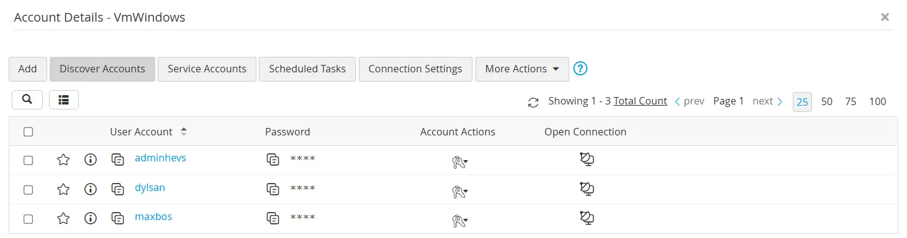

### **5.4.2 Ubuntu VM**:

Use the **Discover Resources** feature:

1. Go to **Resources → Discover Resources**
2. Select:
    - **Type**: Linux
    - **Discover By**: Hostname or IP (you can also specify a range)
3. Create a discovery profile:
    - **Name**: `LinuxProfile`
    - **SSH Port**: 22
    - **Authentication**: Manual (enter the Ubuntu VM username and password)
    - **Account Discovery**: Enabled


1. Run the discovery scan.
2. Add the discovered VM to PAM360.


Now that the Windows and Linux VMs are added, try initiating remote sessions directly from PAM360 to ensure proper configuration and user mapping.

🎉 **Congratulations!** You’ve successfully set up PAM360 in a cloud-based Azure environment. Your privileged accounts are now centrally managed and ready for secure usage.

# 6. Use cases

## 6.1 Installing PAM Agent

[PAM360 Agent](https://www.manageengine.com/privileged-access-management/help/installing-pam360-agent.html)

### What is PAM360 Agent ?

The Agent enables secure, remote management of systems that are not directly connected to the PAM360 server. It uses outbound HTTPS communication, requiring no VPNs or firewall changes, and supports both Windows and Linux environments. Agents periodically check in with the server to receive and execute tasks such as password resets. This is especially useful for managing machines in isolated networks, like those in a DMZ, or resetting passwords on domain accounts without direct access to domain admin credentials—for example, updating credentials on remote branch office servers without exposing them to the core PAM infrastructure.

### Objective

To securely connect remote systems (e.g. VMs or servers in a separate subnet) to PAM360 for centralized password rotation and management, using the PAM360 Agent over HTTPS.

### Context

In our PAM360 project setup, we used an isolated virtual machine as the test environment for the PAM Agent installation. The agent VM had no direct access to the PAM360 server subnet, mimicking a real-world DMZ or branch-office scenario. This allowed us to test agent registration, secure certificate-based trust, and the ability to push credential operations remotely.

### **Prerequisites**

- PAM360 server is running and reachable via HTTPS from the agent VM (outbound).
- PAM360 server SSL certificate available for import.
- Agent installer downloaded from the PAM360 server UI.
- Administrative rights on the agent machine (Windows/Linux).
- Agent hostname configured to match the SSL certificate (or subject alternative name).

### Step 1: **Open PAM360 Web UI** in a browser on the agent VM:
    
    `https://<PAM360-IP>:8282`
    
### Step 2: Click the 🔒 padlock in the address bar → View Certificate → Details → Copy to File

### Step 3: Export the certificate as a `.cer` file

### Step 4: Open **certmgr.msc** on the agent machine

### Step 5: Import the `.cer` file into:
    
- **Trusted Root Certification Authorities → Certificates**

### Step 6: Run the PAM360 Agent installer
- Ensure you use the host name that matches the certificate subject (e.g. pam360.company.local)
- Set SSL Certificate Installed = Yes
- Use the Agent Key from the PAM360 Web UI under Admin → PAM360 Agent

### Step 7: After successful installation
- The agent should appear under **Admin → PAM360 Agent** with status **"Connected"**.
- You can now assign password reset tasks or perform remote actions on the target system.


Verifying pam agent into PAM360 console


### Conclusion

## 6.2 Importing Active Directory to PAM360

### **How Does PAM Integrate with Active Directory (AD)?**

Active Directory (AD) is a centralised directory service that manages user identities and their access rights to network resources. However, it does not natively provide advanced management of privileged accounts—such as admin accounts, critical service accounts, or root accounts on Linux servers.

This is where Privileged Access Management (PAM) comes in. PAM adds layers of control, monitoring, and protection specifically for privileged accounts on top of AD.

- PAM secures privileged accounts by replacing static passwords with temporary, controlled access.
- It segregates standard and administrative accounts using a secure credential vault.
- It enables Just-in-Time (JIT) access for specific tasks only when needed.
- It logs and records all admin activities for full auditing and accountability.

### **Why Use PAM with Active Directory?**

Active Directory is a prime target for attackers, as it controls access across the entire organisation. If a privileged AD account is compromised, an attacker could gain full control over your network.

Threats Mitigated by PAM:

- Pass-the-Hash Attacks: Exploiting NTLM hashes of AD credentials.
- Golden Ticket Attacks: Using forged Kerberos tickets (TGTs) to impersonate users.
- Credential Dumping: Extracting passwords from memory (e.g., via Mimikatz).
- Shadow Admins: Hidden high-privilege accounts not easily visible in AD.

PAM reduces these risks by eliminating permanent privileged access and applying strict controls.

### Objective

### Context

### **Prerequisites**

### Step x:

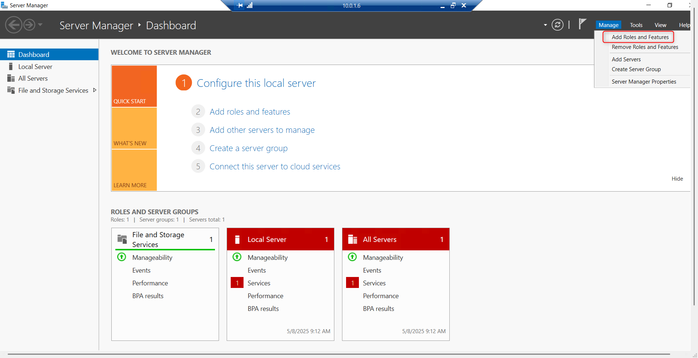

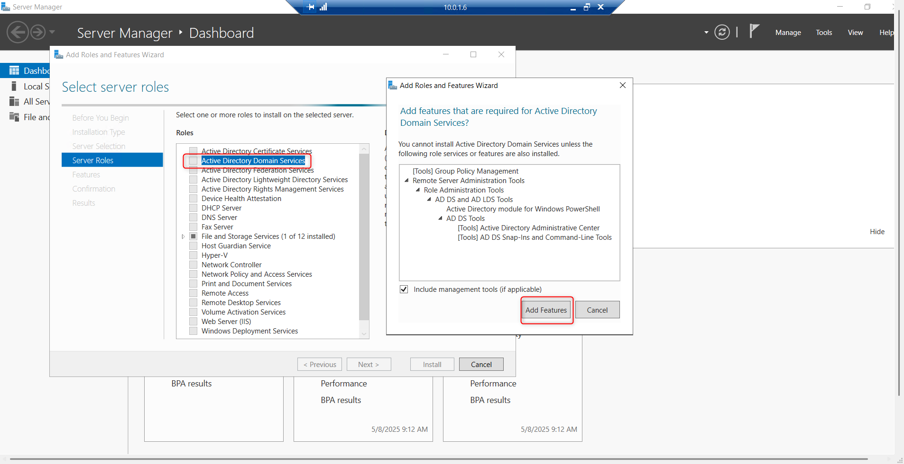

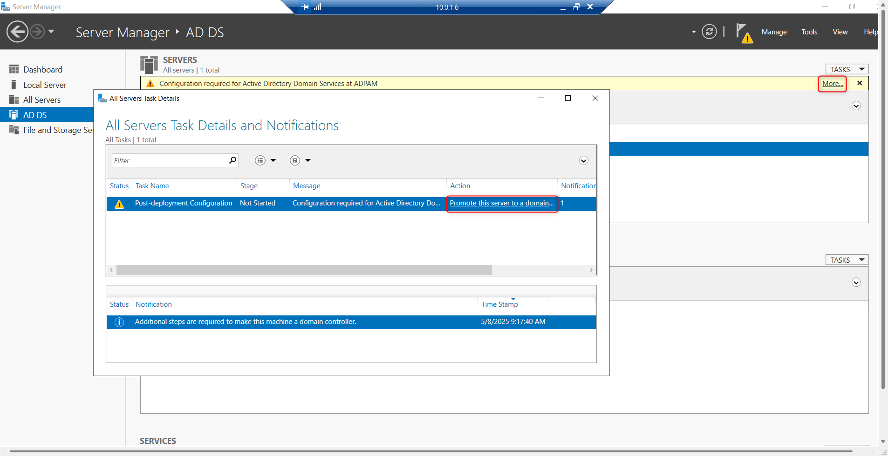

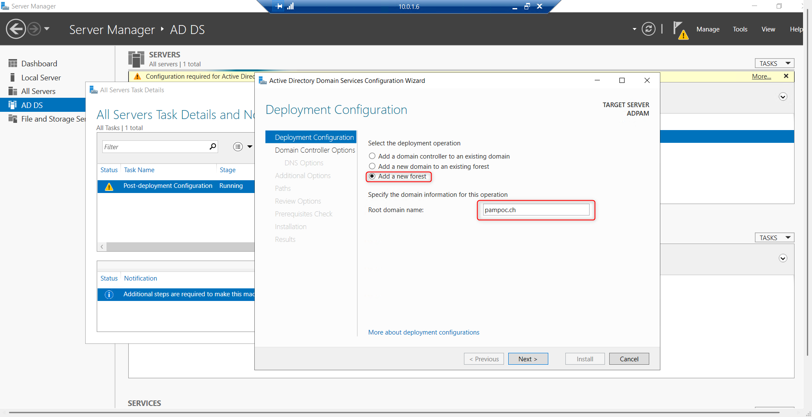

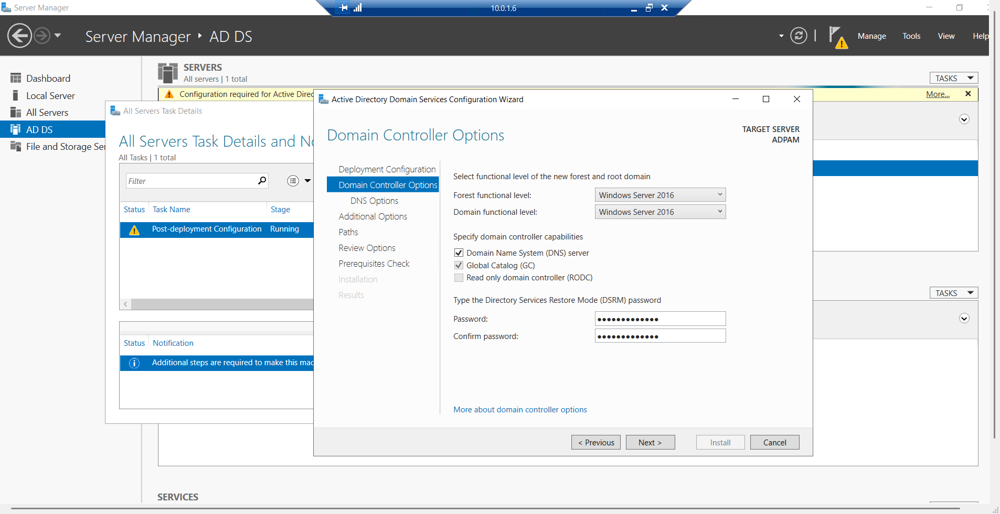

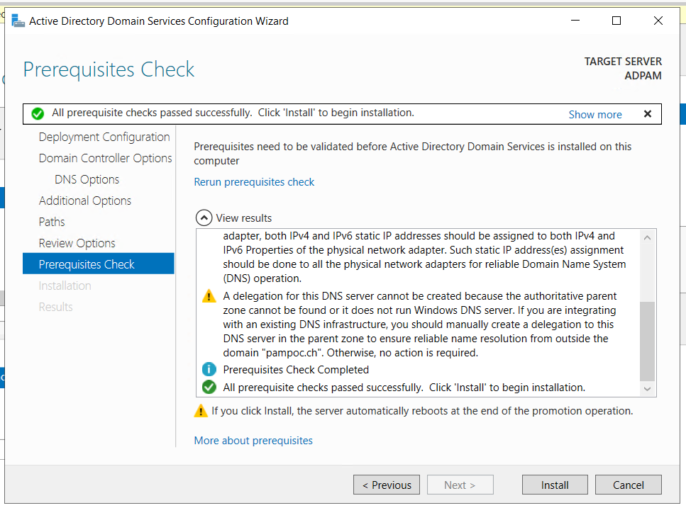

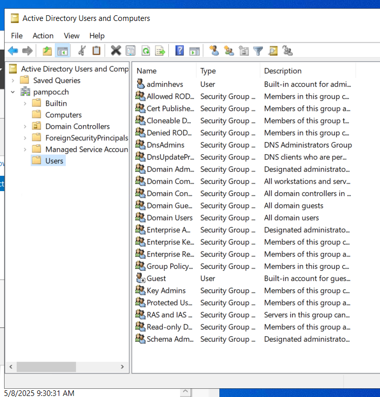

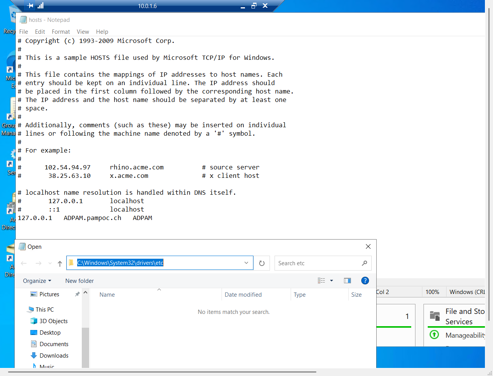

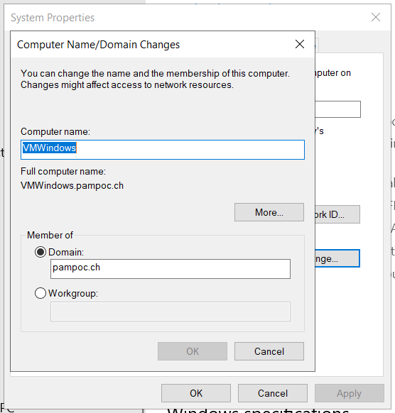

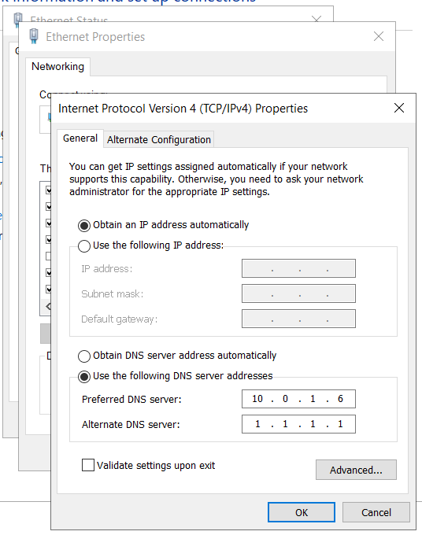

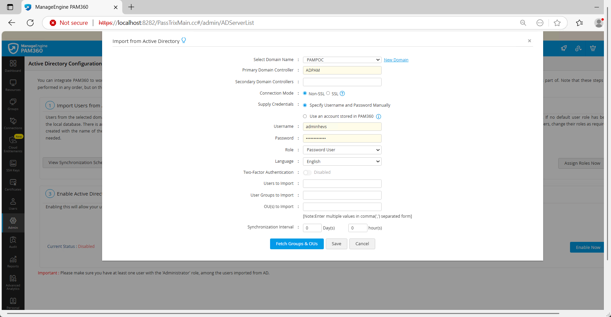


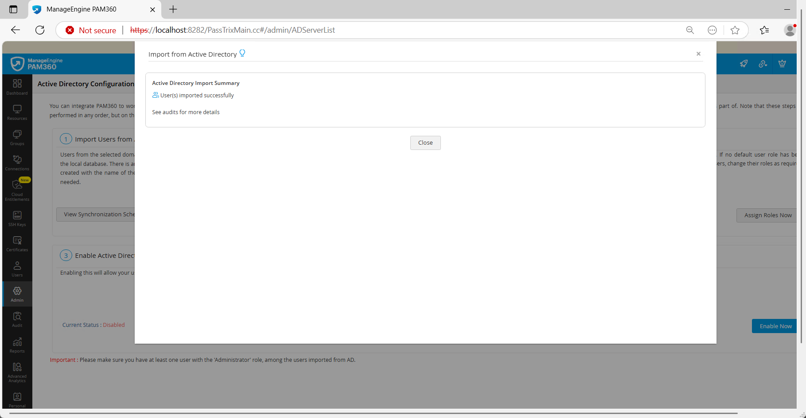

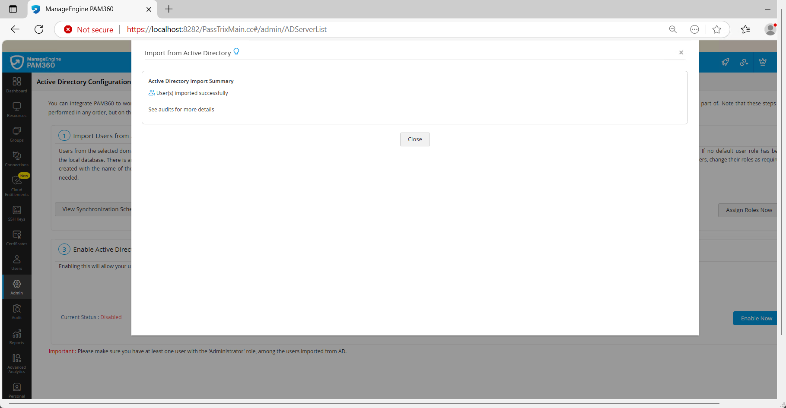

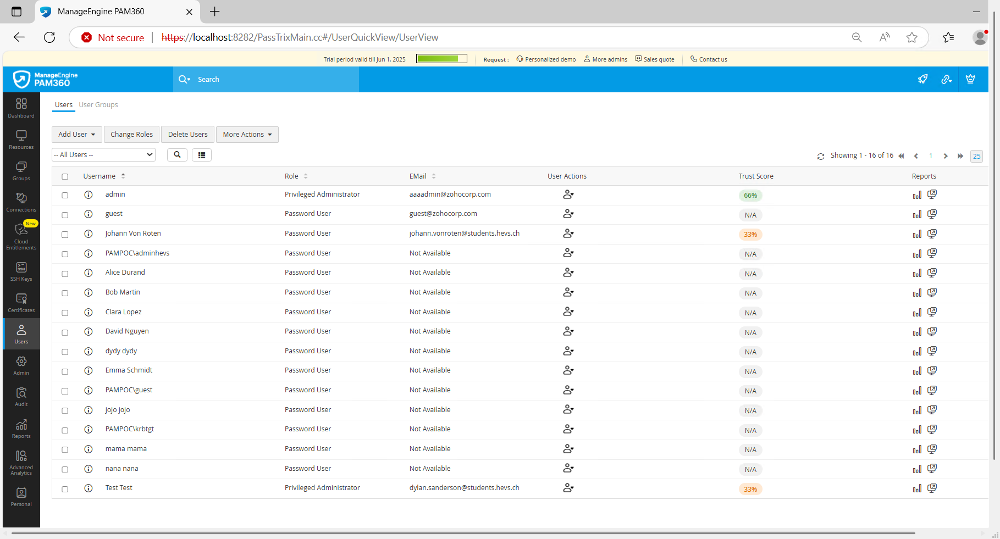

```powershell
# Import du module Active Directory
Import-Module ActiveDirectory

# Chemin cible dans l'AD (Users est un conteneur, donc "CN=" et non "OU=")
$ou = "CN=Users,DC=pampoc,DC=ch"

# Nom du groupe de domaine par défaut
$defaultGroup = "Domain Users"

# Liste des utilisateurs à créer
$users = @(
    @{Prenom="Alice"; Nom="Durand";  SamAccountName="adurand";  Password="P@ssw0rd123!"},
    @{Prenom="Bob";   Nom="Martin";  SamAccountName="bmartin";  Password="P@ssw0rd123!"},
    @{Prenom="Clara"; Nom="Lopez";   SamAccountName="clopez";   Password="P@ssw0rd123!"},
    @{Prenom="David"; Nom="Nguyen";  SamAccountName="dnguyen";  Password="P@ssw0rd123!"},
    @{Prenom="Emma";  Nom="Schmidt"; SamAccountName="eschmidt"; Password="P@ssw0rd123!"}
)

# Création des comptes
foreach ($user in $users) {
    $nomComplet = "$($user.Prenom) $($user.Nom)"
    $securePass = ConvertTo-SecureString $user.Password -AsPlainText -Force

    # Création de l'utilisateur
    New-ADUser `
        -Name $nomComplet `
        -GivenName $user.Prenom `
        -Surname $user.Nom `
        -SamAccountName $user.SamAccountName `
        -UserPrincipalName "$($user.SamAccountName)@pampoc.ch" `
        -AccountPassword $securePass `
        -Path $ou `
        -Enabled $true `
        -ChangePasswordAtLogon $true

    # Ajout explicite au groupe "Domain Users"
    Add-ADGroupMember -Identity $defaultGroup -Members $user.SamAccountName

    Write-Host "✅ Utilisateur créé et ajouté à '$defaultGroup' : $nomComplet"
}
```


### Conclusion

## 6.3 Sending audit notifications

[https://www.manageengine.com/privileged-access-management/help/audit_notifications.html](https://www.manageengine.com/privileged-access-management/help/audit_notifications.html)

### Objective

### Context

### **Prerequisites**

### Step x:

### Conclusion

## 6.4 Storing SSL certificates

[Manage SSL Certificates](https://www.manageengine.com/privileged-access-management/help/manage_ssl_certificates.html)

### Objective

This use case demonstrates how to **centralize the management of SSL/TLS certificates** in **PAM360**, helping organizations avoid outages, enforce access control, and maintain auditability.

### Context

Organizations often handle **dozens or even hundreds of SSL certificates** across servers, applications, and environments. Without centralized control, **expired certificates** can lead to downtime, failed connections, and compliance issues.

**PAM360** provides:

- Centralized storage and visibility
- Expiry notifications
- Role-based access control
- Audit logging of certificate actions

Roles in the Certificate Workflow

| Role | Responsibility |
| --- | --- |
| **IT Security Admin** | Manages, imports, and generates certificates |
| **Web Server Admin** | Deploys certificates, with limited access |
| **Compliance Officer** | Reviews audit logs and tracks certificate usage |

### **Prerequisites**

- Admin access to **PAM360**
- Certificate files (e.g., `.cer`, `.crt`, or `.pem`)
- Or a need to generate an internal certificate

### Step 1: Access the Certificates Menu

- In PAM360, go to the **top navigation bar**
- Click **Certificates**

### Step 2: Import an Existing Certificate

If you already have a certificate:

1. Go to **Certificates → Add → Import Certificate**
2. In the import window:
    - Browse and upload the certificate file (e.g., `chanter_cert.cer`)
3. Click **Add**

**Best practice**: Add metadata like usage purpose, expiry date, or associated system.

### Step 3: Generate a New Internal Certificate (Optional)

To create a certificate using **PAM360’s built-in Certificate Authority (CA)**:

1. Go to **Certificates → Create Certificate**
2. Fill in:
    - **Common Name (CN)** – e.g., `internal-dashboard.local`
    - Organization, location, and contact info
    - Validity period (in days)
3. PAM360 generates a **certificate + private key pair**
4. You can:
    - **Download** it for manual deployment
    - Or **push** it directly to a target server

### Step 4: Issuing a Certificate for an Internal Tool

Suppose your DevOps team needs an SSL cert for a new dashboard:

- The **IT Security Admin** logs into PAM360
- Creates a certificate for `internal-dashboard.local`
- Shares it with the **Web Server Admin** only
- PAM360 logs the event, visible to the **Compliance Officer**

This allows secure, rapid certificate provisioning **without third-party involvement**—ideal for **internal services and test environments**.

### Security Features

- **Access Control**: Certificates can be restricted to specific users or teams
- **Audit Logging**: All import, download, and access operations are logged
- **Expiry Tracking**: PAM360 notifies admins before expiration

### Conclusion

With PAM360, your organization can:

- **Avoid service disruptions** due to expired certificates
- **Standardize and centralize** certificate storage
- **Control who can use, view, or export certificates**
- Maintain a **complete audit trail** of all certificate operations

Whether importing third-party certificates or generating internal ones, PAM360 ensures your **certificate lifecycle is secure, automated, and compliant**.

## 6.5 Setting a VPN access

### Objective

### Context

### **Prerequisites**

### Step x:

### Conclusion

## 6.6 Creating Users and Configuring Control Access Policies

### Objective

This use case demonstrates how to:

- Create and configure users in **PAM360**
- Share only the necessary resources securely
- Define **role-based privileges**
- Enforce **Access Control Policies** to protect sensitive credentials

### Context

In a secure environment, it's essential to give users **only the access they need—nothing more**. PAM360 helps organizations achieve this with **fine-grained user roles**, **resource sharing**, and **approval workflows** for accessing privileged data.

We will walk through the process of:

1. Creating a basic user
2. Assigning roles and permissions
3. Sharing resources
4. Enforcing approval-based password access via **Access Control Policies**

### Step 1: Create a New User

1. Navigate to **Admin > Users > Add User**
2. Fill in the required fields:
    - **First Name**, **Last Name**, and **Username**
    - **Email Address** (used for notifications)
3. **Select a Role** — for this example, use **Password User**
    
    This role allows:
    
    - Viewing shared passwords
    - No management or administrative rights
        
        
        
    
    You can also define custom roles if default ones don’t fit your use case. Learn more
    
    1. **Scope**: Select **Passwords Owned and Shared**
        
        > Choosing All Passwords makes the user a Super Administrator
        > 
    2. Under **Password Setup**, select **Generate Password**
        - This sends login credentials to the user's email
    3. Leave remaining fields as default and click **Add User**


The new user receives an email with:

- Role description
- Login credentials


### Step 2: Share Resources with the User

By default, the user has **no access to resources**.

1. Go to **Resources**
2. Select the target machines (e.g., Windows and Linux)
3. Choose **Share > Share Resource**
4. Grant **View Passwords** permission only


### Step 3: First Login

1. Log in as the new user
2. The system prompts a **password change** for security


After login, the user will:

- Be directed to the **Resources** tab
- See only the machines that were shared


When the user opens a resource:

- Only **“View”** and **“Verify Password”** actions are available
- Options like **“Change Password”** are disabled (greyed out)


### Step 4: Set Up Access Control Policy

To go further and restrict access based on time, approval, or session, enable **Access Control Policies**.

1. Log in as **Administrator**
2. Go to the resource and click **Resource Actions > Configure Access Control**
3. Define **Approvers** (e.g., Admin account)
    - They will review and approve access requests
        
        
        
4. Define **Exempt Users** (e.g., Admins with auto-access)
    
    
    
5. Configure advanced options as shown in the printscreen
    
    
    
6. (Optional) Skip manual approval for specific time windows
    
    
    

Click **Save & Activate**

> If you had ManageEngine ADManager Plus, you could also configure **Just-In-Time (JIT) privilege elevation** for Windows Domain accounts—but it’s not available in this setup.
> 

### Step 5: Test the Access Request Process

1. Log back in as the Password User
2. Navigate to a shared resource
3. Click **Request** to request password access
- Now go back and connect with the password user we’ve created previously. If you navigate to the resources and then click on it, notice the password is not visible and replace by a “Request” button


- Fill in a reason and select **“Now”** for access time


- Admin logs in and sees the request on the dashboard


- Go to **Admin > Access Review > Password Access Requests**


You will have the list of request password with the field “Process request”


- Click **Process Request > Approve** and add a reason


- The user will be notified by mail that the password is now accessible, along with approval details


- Go back to previously created user and click on “Check out”. It will prompt you a message telling you that you have 30 minutes and then the password will be revoked back. Click on “Check out” again.


You can now access the machine and see the password.


- Once this is done, click on check-in. If you try to login again, it will fail since you need a new approval to connect to the machine after checking in !


> If the admin **rejects the request**, the user receives a denial email. The password remains inaccessible, but the user can still submit a new request later.
> 

### Conclusion

This use case demonstrates how PAM360 allows secure, policy-driven user access by:

- Creating role-limited users
- Sharing only required resources
- Applying approval-based access policies
- Auditing password check-outs and enforcing check-ins

With PAM360, organizations ensure that **users access only what they are authorized to**, and **admins maintain complete control and visibility** over privileged operations.

## 6.7 Securing Personal Data with a Passphrase

[https://www.manageengine.com/privileged-access-management/help/personal_passwords.html](https://www.manageengine.com/privileged-access-management/help/personal_passwords.html)

### Objective

This use case explains how to **set up and manage a personal encryption passphrase** within **PAM360**. This passphrase is essential for encrypting and securing sensitive personal data, such as credentials, financial records, or contacts—accessible only to the authenticated user.

### Context

While PAM360 centrally manages shared resources and privileged accounts, it also allows each user to maintain a **personal data vault**. This private section is secured with a **user-defined passphrase** and is **not accessible by administrators**, ensuring complete ownership and confidentiality.

The **passphrase** acts as a **local encryption key** for securing your personal data. It is neither stored nor retrievable, which means:

- Only the user knows it
- Without it, the encrypted data cannot be decrypted
- If forgotten, data recovery is **not possible**, and the vault will be reset

### Prerequisites

- User must have access to the **PAM360 Web Interface**
- No previous personal passphrase should exist (or it must be reset)

### Step 1: Create Your Personal Passphrase

1. Navigate to the **“Personal”** tab in PAM360
2. You’ll be prompted to create a **personal passphrase** for data encryption

> 💡 Why is this important?
> 
> 
> Your passphrase is used to **locally encrypt** your data within PAM360. Without it, no one—including administrators—can view or decrypt your personal entries. This is a core principle of **zero-knowledge encryption**.
> 


PAM360 enforces complexity by default to protect your data against brute-force and dictionary attacks.

Ensure your passphrase meets the following conditions:

- Minimum length requirement
- At least one uppercase, lowercase, number, and special character

**Tip**: Use a passphrase that is strong but memorable (e.g., a sentence or phrase with symbols).


### Step 2 : Re-access Your Personal Vault

Whenever you revisit the **Personal** section, PAM360 will request your passphrase to decrypt your data:

If entered correctly, you'll regain access to all personal entries in your encrypted store.


### Step 3: Use the Four Default Personal Data Categories

Upon successful setup, you gain access to a secure, encrypted vault divided into four default categories:

1. **Web Accounts**
2. **Bank Accounts**
3. **Credit Card Accounts**
4. **Personal Contacts**

Each category allows you to store detailed, encrypted entries that only you can view.

Example with for bank accounts :


### Step 4: What If You Forget Your Passphrase?

If your passphrase is lost or forgotten:

- PAM360 **cannot recover it**
- You must **reset** it
- Resetting will **permanently delete all existing personal data**

> ❗ Warning: Treat your passphrase like a digital safe key—once lost, the contents inside are unrecoverable.
> 

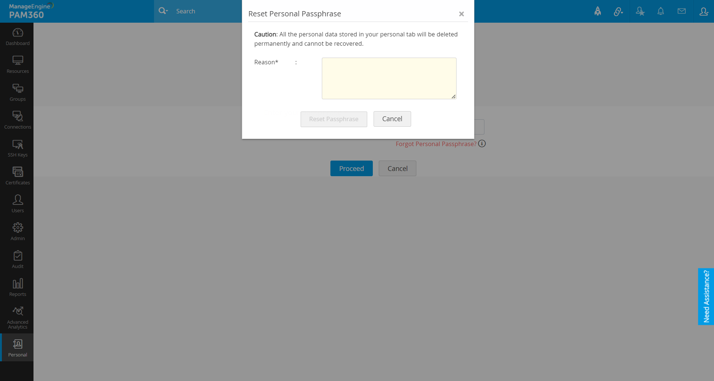

### Conclusion

By setting a **personal encryption passphrase**, PAM360 empowers users with a **private, secure vault** inside the platform:

- Your data is **encrypted locally** and can only be accessed with your unique passphrase
- No administrator or system process can view or reset your data without your consent
- It enforces best practices in **data privacy**, **ownership**, and **zero-trust security**

You now have a **personal digital safe** inside PAM360—protected by you, and you alone.

## 6.8 Managing and Enforcing Password Security

### Objective

This use case demonstrates how to **change, reset, and enforce password policies** for accounts managed in **PAM360**. It also shows how to handle **policy violations** and perform **bulk password resets** that synchronize directly with target systems.

### Context

Privileged account passwords are a critical part of enterprise security. In PAM360, administrators (or authorized users) can manage these passwords efficiently across systems—while maintaining compliance with defined **password policies**.

Key benefits include:

- Centrally managed password lifecycle
- Auto-enforcement of complexity rules
- Audit trails and notifications
- Remote sync with connected machines

### Step 1: Change a Password Manually (With Remote Sync)

As an **Administrator** or a **Password User** with the right permissions:

1. Go to **Resources > [Windows Resource]**
2. Under **Account Actions**, select **Change Password**
3. Enter a new password
4. Check the box for **“Apply password changes to the remote resource”**

This ensures that the password is **updated both in PAM360 and on the remote Windows machine**, keeping them in sync.


Passwords are automatically stored and encrypted, and can be retrieved or rotated as needed.

### Step 2: Monitor Password Policy Violations

PAM360 includes built-in password policies and enforcement rules. By default, the platform offers:

- **Low**: Minimal constraints
- **Medium**: Moderate complexity
- **Strong**: Strict password rules
- **Offline password file**: For file-based access only

You can also define custom policies with the following parameters:

- Minimum/maximum length, required character types
- Restrictions on dictionary words, repeated characters, or login names
- Enforcement of expiration rules
- Reuse prevention
- Sequence blocking

> [Read the full guide on custom policies](https://www.manageengine.com/privileged-access-management/help/password_policies.html#create)
> 

### Step 3: Identify Violations from the Dashboard

1. From the **Dashboard**, click on **Policy Violations** at the top
2. This provides an overview of passwords that **do not comply** with the policy assigned to their resource
    
    
    
    
    

### Step 4: Review Violations Per Resource

1. Go to **Resources**
2. Click **Policy Violations**
3. You will see a detailed list of all **non-compliant accounts**


### Step 5: Perform a Bulk Password Reset

To resolve the violations:

1. In the **Policy Violations** screen, click **Reset All Passwords**
    - You can also reset selected accounts individually
2. In the reset dialog:
    - Set **Password Allocation** to *Generate unique passwords for every account*
    - Enable **Apply password changes to remote resource(s)**
    - Enable **Send email notification to users**


- The system will prompt you to select the users that will receive the email notifications. Let’s only send the email to the Administrators.


### Step 6: Bulk Operation Execution and Audit Trail

Once triggered:

- The system attempts to **reset and sync** passwords across all affected accounts
- If remote sync is configured, changes are applied directly to the machines
- You can monitor the operation via **Audit > Resource Audit**


An email is sent to the selected users, summarizing:

- Affected accounts
- New password status
- Operation success/failure per resource


### Step 7: Test

Go back to **Resources** and confirm that:

- Passwords were successfully changed
- Accounts now show as **compliant** with their assigned password policies


As a final test, try connecting to one of the resources (e.g., a Linux machine) using the **newly reset password** to verify proper synchronization.


### Conclusion

This use case illustrates how PAM360 simplifies and secures password management by:

- Providing centralized tools to **change or reset passwords**
- Enforcing **strong password policies**
- Offering **bulk remediation** for non-compliant accounts
- Keeping systems and PAM360 **synchronized**
- Maintaining complete **audit visibility** and **user notifications**

With these capabilities, PAM360 ensures that **password hygiene and policy enforcement** are not only automated, but also auditable and secure.

## 6.9 Enabling MFA with Google Authenticator in PAM360 accounts

### Objective

This use case demonstrates how to configure **Multi-Factor Authentication (MFA)** in **PAM360** using **Google Authenticator**. The goal is to enhance login security by requiring a time-based One-Time Password (OTP) in addition to a user’s credentials.

### Context

With increasing risks of credential theft and brute-force attacks, relying solely on usernames and passwords is no longer sufficient. **Two-Factor Authentication (2FA)** strengthens your PAM360 instance by adding a **dynamic authentication layer**. In this guide, we’ll use **Google Authenticator** as the 2FA method.

### Prerequisites

- You must have **admin access** to PAM360.
- PAM360 must already be installed and running on your Azure VM.

---

### Step 1: **Log in to PAM360 as Administrator**

Access your PAM360 web portal, e.g.:

`https://<your-pam360-server>:8282`

### Step 2: Choose Google Authenticator as Your 2FA Method

- Go to **Admin > Authentication > Two-Factor Authentication**
- Click **“Enable Two-Factor Authentication”**
- From the available options, select **Google Authenticator**
- Click **Save** to confirm the configuration
- Choose **Google Authenticator** as your 2FA method.
- Save the configuration.


### Step 3: **Assign MFA to Specific Users**

- Under the same menu, go to **“Configure Users”**.
- Select the users who should use MFA.
- Click **“Enroll”** for each user.


### Step 4: **First-Time Login for Users**

The next time a user logs in:

- PAM360 will show a **QR code**.
- User must scan it using the **Google Authenticator app** on their phone.
- They’ll enter the **6-digit OTP** to complete login.
    
    
    

### Step 5: **(Optional) Enforce MFA for All Users**

To make MFA mandatory across the platform:

- Go to **Admin > Authentication > Two-Factor Authentication**
- Enable the toggle: **“Enforce for all users”**

This ensures **every user** must authenticate with an OTP.

### Conclusion

With MFA enabled via Google Authenticator:

- Every login now requires a **valid OTP** in addition to the password
- This adds a robust **layer of protection** against stolen or leaked credentials
- PAM360 becomes more resilient to unauthorized access attempts

This simple but powerful step significantly strengthens your security posture.

## 6.10 Enabling TOTP-Based Two-Factor Authentication in PAM360

### **Objective**

This use case demonstrates how to configure and test **Time-based One-Time Password (TOTP)** authentication in **PAM360**, using **Google Authenticator**. You’ll integrate a demo web app hosted on Azure and connect it with PAM360 for credential and TOTP management.

### Context

Multi-factor authentication (MFA) adds a critical layer of security to sensitive accounts. In PAM360, **TOTP-based 2FA** enhances login protection by requiring a rotating time-based code—generated by apps like **Google Authenticator**.

In this example, we will:

- Deploy a Flask-based login demo with TOTP on Azure
- Secure its credentials using PAM360
- Use PAM360 to store and autofill login credentials + TOTP
- Validate the setup through real interaction

### Prerequisites

- Admin access to **PAM360**
- A **GitHub account**
- An **Azure account** (free tier available)
- Google Authenticator or compatible app on your phone

### Step 1: Deploy the Flask TOTP Demo App on Azure

We have already created a small Flask app for you implementing a basic login page, with 2FA as a second criteria to login. 

[pam360_totp_demo-master.zip](pam360_totp_demo-master.zip)

- Download the TOTP demo app
- Extract the code and push it to your own **GitHub repository**
- On the **Azure Portal**:
    - Create a **Web App**
    - Use **Free (F1)** pricing tier
    - Select Python as the runtime (latest version recommended)
        
        
        
- In the **Deployment Center** of the Web App:
    - Connect it to your GitHub repository
    - Deploy from the branch your code is hosted on


Ensure the application deploys correctly

> If there are deployment issues, troubleshoot via Azure logs
> 

### Step 2: Add the Web App as a Resource in PAM360

1. Log in to **PAM360** with an admin account
2. Go to **Resources > Add Resource**
    - **DNS/IP Address**: Use the Azure Web App Domain
    - **Resource Type**: Web Site Accounts
    - **Resource URL**: Use the Azure Web App URL
    - **Session Recording**: Enable both options


### Step 3: Add the Demo Account

1. Use these credentials from the Flask app:
    - **Username**: `admin`
    - **Password**: `pass123`
    - **TOTP Secret Key**: `JBSWY3DPEHPK3PXP`
2. When entering the **TOTP Secret**, keep the **default encryption settings**
    
    > ⚠️ Note: Once saved, the TOTP Secret cannot be retrieved
    > 


### Step 4: Install and Configure the PAM360 Browser Extension

We will also install PAM browser Extension so that you can access, record website session and also fill up automatically pages with PAM360.

1. Open **Edge > Extensions**
2. Enable **Allow extensions from other stores**
    
    
    
3. Install the [ManageEngine PAM360 Extension](https://chromewebstore.google.com/detail/manageengine-pam360/cdkfhfalbgbjedofghkapcgeodemhghp)
4. Click on the extension icon and configure:
    - **Server**: `http://localhost`
    - **Port**: `8282`

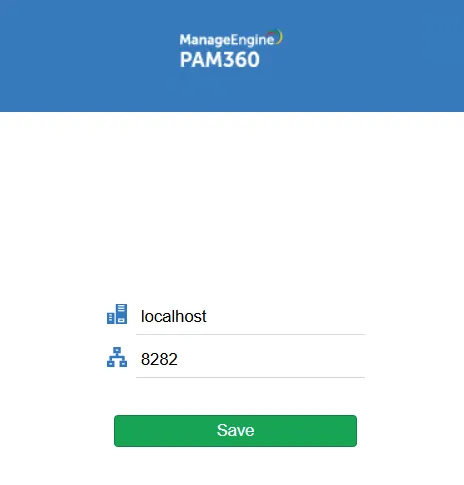

### Step 5: Access the Web App via PAM360

This extension will open up all resources currently available on PAM. 

1. In the extension, select your Web App resource
2. Choose **HTTPS Gateway Connection**
    
    
    
- The extension will **autofill the username, password, and TOTP**
- The login form is submitted, and the session is recorded

> 💡 If autofill fails, you can manually access the Account Details in PAM360 to retrieve the password and TOTP code.
> 
> 
> 
> 

### Step 6: Verify Successful Login

After correct autofill, the demo app authenticates and shows a **successful login message**. This proves that:

- PAM360 correctly stores and encrypts the TOTP secret
- PAM360 can generate valid time-based codes
- Login automation with PAM360 browser extension works as expected


### Conclusion

This use case demonstrates how PAM360 can be used to manage **2FA credentials and TOTP secrets** for web applications:

- TOTP integration adds **stronger authentication**
- PAM360 stores secrets securely and **autofills login forms** via browser extension
- Passwords and TOTP codes are **centrally controlled, encrypted, and auditable**

With this setup, PAM360 can manage secure access even for applications requiring two-factor authentication, combining usability with compliance.

## 6.11 Configuring Zero Trust Framework

[https://www.manageengine.com/privileged-access-management/help/zerotrust.html](https://www.manageengine.com/privileged-access-management/help/zerotrust.html)

[https://www.crowdstrike.com/en-us/cybersecurity-101/zero-trust-security/](https://www.crowdstrike.com/en-us/cybersecurity-101/zero-trust-security/)

[https://www.ibm.com/think/topics/zero-trust](https://www.ibm.com/think/topics/zero-trust)

[https://learn.microsoft.com/en-us/security/zero-trust/zero-trust-overview](https://learn.microsoft.com/en-us/security/zero-trust/zero-trust-overview)

[https://www.cloudflare.com/learning/security/glossary/what-is-zero-trust/](https://www.cloudflare.com/learning/security/glossary/what-is-zero-trust/)

### Zero Trust

Zero trust is a security strategy based the principle [“never trust, always verify”](https://www.ibm.com/think/topics/zero-trust). This means that not all users should be trusted by default, even if within your network or using privileged access within your corporation. Threats can exist both inside and outside the network, and many businesses now use cloud solution, IoT devices, remote applications, … This makes the range of attack much wider and we can never be sure that some actions by some users are really worth of being trusted.

These are some key concepts of Zero Trust in general focus on : 

1. Continuous verification and monitoring : notably via risk-based policies, conditional access to resources, … Constant monitoring to be sure every accessed is secured at all times, even throughout the session.
2. Principle of Least Privilege : Grant only what the minimum permissions to users or devices, based on their tasks.
3. Micro-segmentation : Breaking up your network into small zones. This helps separating the access of some resources to specific parts of the network only.
4. Assume breach :  Always be on edge and make the actions that you would use to mitigate a cyberattack become part of the normal routine of your security policies.
5. Multi-factor authentication : Used has another barrier to protect credentials, making passwords not enough in case of credential theft.

Here are some key benefits of using Zero Trust in a company :

| Benefit | Description |
| --- | --- |
| Enhanced Security | Reduces breach risk and limits attacker movement |
| Reduced Attack Surface | Fewer entry points for cyber threats |
| Efficient Threat Response | Rapid detection and containment of suspicious activities |
| Improved User Experience | One point of entry for access and authentication |
| Cost Savings | Lower breach costs and reduced need for multiple security tools |
| Support for Modern Work | Enables secure cloud, remote, and hybrid work |
| Regulatory Compliance | Easier to meet compliance requirements and maintain audit trails |
| Accurate Asset Inventory | Better visibility and control over users, devices, and resources |

You can implement it using many standards. Here you can see the Zero Trust Framework from The National Institute of Standards and Technology for the United States (NIST) to illustrate how it can be set up.

](images/nist-zero-trust-framework-1024x480.png)

[https://www.crowdstrike.com/en-us/cybersecurity-101/zero-trust-security/](https://www.crowdstrike.com/en-us/cybersecurity-101/zero-trust-security/)

### Zero Trust in PAM360

PAM360 has also the capabilities of enabling Zero Trust with its software solution. 

Let’s see PAM360’s approach on this topic :


1. **Validate Users and Resources**
    - The first step is to confirm the identity and integrity of both users and the resources they are trying to access. This often involves verifying credentials, roles, and device security posture.
2. **Verify Access Policy**
    - Next, PAM360 evaluates predefined **access policies** to check whether the access request aligns with what is permitted. Policies may be based on roles, risk levels, behaviour, or context (e.g., time, location).
3. **Grant / Deny Access**
    - Based on the access policy evaluation, PAM360 either **grants or denies access**. This decision is dynamic and contextual, consistent with the Zero Trust principle of "never trust, always verify".

Now how does PAM360 implement Zero Trust ?


- **Installing PAM360 Agent in User Devices and Resources**
    - Deploying PAM360 agents on endpoints and critical resources to enable monitoring, enforcement, and access control.
- **Configuring Trust Score Parameters – Users and Resources**
    - Defining **parameters** that determine the trustworthiness of users and assets (e.g., user role, behaviour history, system vulnerabilities).
- **Configuring Trust Score Weightage**
    - Assigning **weights** to different parameters, reflecting their importance in the overall trust evaluation.
- **Access Policy Configuration**
    - Creating and defining **access control rules** based on trust scores, organisational policies, and compliance requirements.
- **Associating Access Policies to Resource Groups**
    - Linking configured policies to specific **groups of resources**, enabling consistent enforcement.
- **Resolving Conflicts between Access Policies**
    - Handling **overlapping or contradictory policies** to ensure clear and secure access decisions.

Only a handful of roles should be allowed to configure Zero Trust on your PAM360. By default :

1. The **Privileged Administrator** role has access to all of these operation privileges.
2. The **Administrator** role can create, manage and resolve conflicts in their access policies, approve access policies and view the access policies created by other administrators.
3. The **Password Administrator** role can perform all operations as **Administrators** except for access policy approval.

Now let’s go to the use case : Implementing Zero Trust Access Control

### Objective

This use case demonstrates how to configure and enforce **Zero Trust policies** in **PAM360**, using dynamic user and resource trust scores. The goal is to ensure that access to sensitive systems is **context-aware** and **continuously evaluated**.

### Context

The **Zero Trust model** is built on the principle of *“never trust, always verify.”* Rather than relying on static credentials or traditional perimeter defenses, Zero Trust in PAM360 evaluates access based on **multiple contextual parameters**, such as:

- User authentication method
- Device type and risk
- Resource sensitivity
- Access control configuration

This dynamic model enables **fine-grained and adaptive access control**, aligning with modern cybersecurity standards.

### Prerequisites

- Administrator access to **PAM360**
- At least one resource added to PAM360 (e.g., Linux machine)
- A basic understanding of trust scores and access policies

### Step 1: Configure Zero Trust Settings

1. Log in as a **Privileged Administrator**
2. Navigate to **Admin > Zero Trust > Configuration**

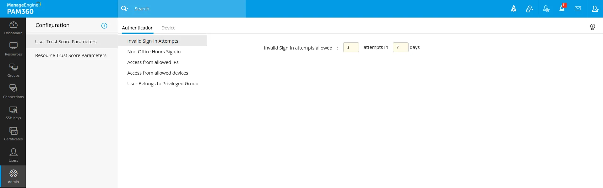

Here, you’ll see **parameters** that influence **User** and **Resource Trust Scores**. 

- **Authentication Factors**: MFA usage, IP reputation, login history
- **Device Context**: Type of device used, browser safety, OS patch level


### Step 2: Customize Trust Score Weightage

1. Go to **Admin > Zero Trust > User Trust Score** or **Resource Trust Score**

Here, you can **assign weights** (0–10) to each parameter. The **total score is capped at 100** and is dynamically calculated at login or during access attempts.

The score will be adapted depending on if a parametric condition is met or not.


### Step 3: Create a Zero Trust Access Policy

Another interesting addition is the Zero Trust Access Policies. Zero Trust policies are enforced **only when multiple security conditions are satisfied**. These include:

1. Assigned **Password Policy**
2. Password Access Control
    1. If enabled, PAM360 will check if access control is properly configured for each account/resource the user owns. If the account or resource does not have access control enabled/configured, the Zero Trust access policy will not consider the criteria satisfied, access will likely be denied.
    2. If disabled, PAM360 will **ignore whether access control is configured** for the account or resource the user owns
3. User Trust Score
4. Resource Trust Score

More info: [Zero Trust Policy Documentation](https://www.manageengine.com/privileged-access-management/help/zt-policies.html)

Now prepare your first policy

- Go to **Admin > Zero Trust > Access Policies**
- Click **Add Policy**
- Name it **“Privileged Policy”**
- Configure conditions as shown:


### Step 4: Approve the Policy (If Required)

After that, the access policy might need to be approved by a super administrator if such role exists.

If policy approval is enabled:

1. Go to **Admin > Access Policies > Process Request**
2. Approve or reject pending policy requests


### Step 5 : Apply the Policy to a Resource Group

1. Navigate to **Groups > Add Group > Static Group**
    
    
    
2. Select the **Linux machine** (or relevant resource) to include in the group
    
    
    
3. Assign your **Zero Trust Policy** to this group from the group settings

### Step 6: Test Access with Low Trust Score

Try logging in to the Linux machine using a **test user** with a low trust score.

- PAM360 will **evaluate trust conditions in real-time**
- If the user's context doesn’t satisfy the policy, access is denied

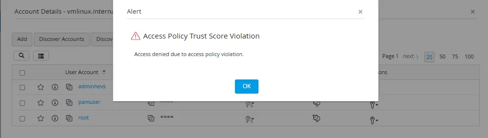

The user also receives an email notification explaining the reason for denial and suggesting to contact an administrator


### Conclusion

This use case shows how PAM360 enables a practical implementation of the **Zero Trust model**:

- **User and Resource Trust Scores** dynamically evaluate context
- Access is granted only when **all conditions are met**
- **Real-time denial and notification** protect against high-risk logins
- Security posture adapts continuously—aligned with modern enterprise standards

You now have a powerful policy-driven access control mechanism that enforces trust **before** access is granted.

## 6.12 Connecting  to GitHub using SSH keys generated by PAM360

### Objective

This use case demonstrates how to use **PAM360** to securely manage and store **SSH keys** used for accessing **GitHub**. It includes generating SSH keys, configuring GitHub to use the public key, storing the private key securely in PAM360, and testing authentication.

### Context

GitHub supports SSH key-based authentication for pushing and pulling code securely without using a password or token. While this is convenient, **private key security is critical**. PAM360 allows you to **safely manage private keys**, associate metadata, and monitor their use—aligning with privileged access best practices.

### Prerequisites

- Admin access to **PAM360**
- A **GitHub account**
- A local terminal with **SSH** and keygen tools installed
- Git installed (to test SSH authentication)

### Step 1: Generate an SSH Key Pair

In your terminal (Linux/macOS/WSL on Windows), run:

```bash
ssh-keygen -t rsa -b 4096 -f "$HOME\.ssh\github_pam360_key"
```

This will generate:

- `github_pam360_key` → Private key
- `github_pam360_key.pub` → Public key


**Alternative**: PAM360 can also generate the key pair for you (with passphrase) via its **SSH Key Management** feature. This will be showcased in the use case 6.xx

### Step 2: Add the Public Key to GitHub

1. Open [GitHub SSH Key Settings](https://github.com/settings/keys)
2. Click **“New SSH key”**
3. Provide a name like `pam360 test`
4. Paste the contents of your `github_pam360_key.pub` file


### Step 3: Store the Private Key in PAM360

1. Go to **PAM360 > Resources > SSH Keys**
2. Click **“Add SSH Key”**
3. Upload the private key file: `github_pam360_key`
4. Optionally, add metadata:
    - **Usage**: GitHub Access
    - **Associated User/Team**
    - **Expiration Policy**, etc.


PAM360 ensures the key is encrypted at rest and access-controlled.

### Step 4: Test SSH Authentication to GitHub

Use the command line to test the private key manually:

```bash
ssh -i ~/.ssh/github_pam360_key -T git@github.com
```

If everything is configured properly, GitHub should respond:

```bash
Hi your-username! You've successfully authenticated...
```

If everything is configured properly, GitHub should respond:

### Conclusion

With this configuration, you can now:

- Use PAM360 to **securely store and track SSH keys**
- Control access to **critical developer tools like GitHub**
- Reduce the risk of **lost or compromised private keys**
- Align with **enterprise-grade key management practices**

This setup demonstrates how PAM360 extends beyond infrastructure management and supports **developer workflows** as part of a **Zero Trust strategy**.

## **6.13 Securing SSH Access and Command Restrictions on a Linux Machine**

[https://www.manageengine.com/privileged-access-management/help/ssh-command-control.html](https://www.manageengine.com/privileged-access-management/help/ssh-command-control.html)

### Objective

This use case showcases how to securely connect to a remote Linux machine using **SSH key-based authentication** managed through **PAM360**, replacing the less secure, traditional password-based approach. The main goals are to:

- Enhance the security of SSH access, especially for privileged (admin) accounts
- Centralize the management of SSH keys
- Restrict command execution to enforce the principle of least privilege

### Prerequisites

Before starting, ensure the following conditions are met:

- A Linux VM is up and running with SSH enabled
- The target Linux host and user accounts are already added as **resources** in PAM360

### Step 1: Create an SSH Key in PAM360

Rather than using static passwords, organizations should leverage **key-based authentication** to secure privileged access.

In PAM360, navigate to **SSH Keys > Add SSH Key** and fill in the required fields:

- **Key Name**: Choose a descriptive name
- **SSH Key Passphrase**: (Recommended) Adds encryption to the private key
    - Protecting the private key with a passphrase mitigates the risk of unauthorized access—even if the key file is compromised.
- **Key Type**: RSA
- **Key Length**: 2048 or 4096 bits


### Step 2: Associate the Key with a Linux Resource

Once generated, the SSH key must be **linked to the appropriate resource** to control where and how it's used.

After generating the key:

1. Click the key in PAM360
2. Choose **Associate**
3. Select your Linux machine and click **Associate** again

Only accounts with appropriate permissions will have the public key deployed, and access will be governed by PAM360’s policies.


### Step 3: Configure PAM360 to Use the Key for Login

1. Go to **Resources > [Linux Machine] > [admin account]**
2. Select **Edit Account**
3. Toggle **"Use Private Key for Login"**

This ensures all SSH sessions initiated via PAM360 use the private key, enhancing security and traceability.


### Step 4: Test the SSH Connection

This step confirms that PAM360 successfully uses the SSH key for authentication.
Run the following command on your Linux VM:

```
sudo systemctl status ssh
```

Look for a log entry that says:

```
Accepted publickey for admin
```

This confirms that key-based authentication is working.


### Optional: Set Up SSH Key Rotation

To reduce the risk of stale or compromised keys, PAM360 supports **key rotation**:

1. Go to **SSH Keys** in PAM360
2. Select the key > **Key Rotation**
3. Choose whether to push private/public keys to the remote system


> ⚠️ Good practice: Enable expiry notifications to receive alerts before a key becomes outdated. This ensures continuous secure access.
> 


### Step 5: Restrict Commands Using Command Control

Limiting what commands can be executed post-login helps mitigate the risk of privilege abuse. PAM360’s command control allows enforcing least-privilege access.

To limit access for a non-admin user:

1. **Create a user** on the Linux VM:

```
sudo adduser pamuser
```

1. Add this user to PAM360 as a managed account
2. Go to **Admin > Manage Commands**

Here, you'll see:

- **Commands**: All defined CLI commands
- **Command Groups**: Logical groupings (e.g., "File System", "Basic Administration")


### Step 6: Assign Command Groups

1. Go to the **pamuser** account in PAM360
2. Click **Configure SSH Command Control**
3. Assign built-in command groups:
    - "File System"
    - "Basic Administration"


After setup, when `pamuser` logs in, they cannot type commands directly. Instead, they'll use a menu of approved commands from the PAM360 interface.


### Conclusion

This use case illustrates how PAM360 enhances SSH access management by:

- Eliminating shared/static credentials
- Securing access with encrypted SSH key pairs
- Auditing and recording SSH sessions
- Enforcing role-based access and command restrictions

You now have a compliant, secure, and auditable SSH access setup aligned with PAM best practices.

## 6.14 Securing Application-Level Access via RemoteApp

[https://www.manageengine.com/privileged-access-management/help/remote-app.html](https://www.manageengine.com/privileged-access-management/help/remote-app.html)

### Objective

This use case demonstrates how to **configure RemoteApp access** using **PAM360**, allowing users to launch **only specific applications** on a remote Windows server—without giving them full desktop access. This enables fine-grained control for scenarios such as:

- Allowing external or low-privileged users to use specific apps (e.g., WordPad) securely
- Preventing misuse or accidental modifications on the host system
- Maintaining a **least-privilege** approach while offering necessary tools

### Context

Instead of granting remote desktop access to a full system—which poses potential security risks—RemoteApp allows access to **individual applications** in isolation. PAM360 provides a streamlined way to manage and restrict these sessions.

### Prerequisites

- A Windows Server with **Active Directory** and **DNS** configured
- PAM360 is installed and accessible
- The **MEAMP** agent is installed on the Windows Server (see next step)
- RemoteApp feature is supported only on Windows machines

**Our scenario**: We want a user to remotely launch only **WordPad** on a Windows Server, without having access to other applications, files, or system resources.

### Step 1: Set Up the Landing Server and RemoteApp Environment

1. Follow the official [Landing Server Setup Guide](https://www.manageengine.com/privileged-access-management/help/landing-server-configuration.html)
    
    → This configures your Windows Server as a **Landing Server** for remote sessions.
    
2. Continue with the [RemoteApp Configuration Guide](https://www.manageengine.com/privileged-access-management/help/amp-remoteapp.html#configampremoteapp)
    
    → Ensure the **MEAMP (ManageEngine Application Manager Plugin)** is installed on your Windows Server.
    
    → Add **WordPad** to the list of available RemoteApps.
    

### Step 2: Register RemoteApp in PAM360

Once your environment is ready:

1. Navigate to **Admin > Remote App**
2. Click **Add** and choose your configured Windows Server
    
    > ⚠️ Only Windows OS is supported for RemoteApp
    > 


### Step 3: Select the Applications

In the Remote App configuration:

- Select the applications (e.g., **WordPad**) you wish to make accessible
- These will be the **only apps** available for selected users


### Step 4: Associate RemoteApps with a Resource

To apply RemoteApp restrictions to a specific machine:

1. Go to **Resources**
2. Select the target Windows VM
3. Click **Associate > Associate RemoteApp**


1. Choose the app(s) you want to allow (e.g., WordPad)


### Step 5: Create a Restricted User

Create a user with the **Connection User** role:

- This role allows **launching apps only**, without access to credentials or passwords
- Navigate to **Admin > Users > Add User**, and select **Connection User** as the role


### Step 6: Share the Resource (RemoteApp Only)

Now that the user and the app are ready:

1. Share the configured resource with the new user
2. Under sharing settings, select **RemoteApp Only**
3. Choose **WordPad** from the list of available apps


### Step 7: Connect to the RemoteApp

The user can now:

1. Go to **Connections** in PAM360
2. Click on the Windows VM shared with them
    
    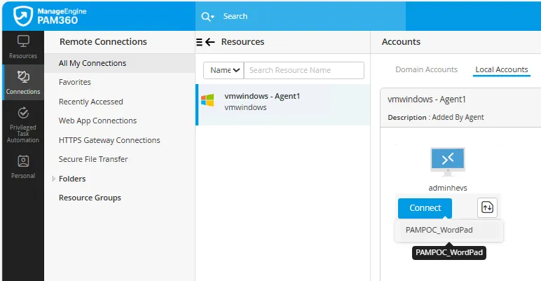
    

PAM360 launches **only the specified app** (e.g., WordPad) in a remote session—**no desktop access is granted**.

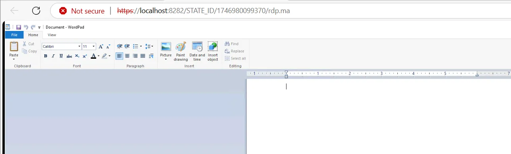

### Conclusion

This use case illustrates how **RemoteApp in PAM360** enables secure, application-specific access to Windows servers:

- Users can access **only authorized applications**, not the full system
- Ideal for **temporary contractors**, **external collaborators**, or **limited-use scenarios**
- Supports centralized control, session logging, and full auditability

You now have a tightly scoped, secure RemoteApp setup using PAM360—fully aligned with modern **least-privilege** and **zero-trust** principles.

## 6.15 Setting up a remote secure session

https://www.manageengine.com/privileged-access-management/help/connections-operations.html

### Objective

### Context

### **Prerequisites**

### Step x:

### Conclusion

## 6.16 Protecting a Cloud SQL Database with PAM360

### Objective

This use case demonstrates how to secure and manage access to a **Microsoft Azure SQL Database** using **PAM360**. You'll learn how to:

- Create and configure a cloud-hosted SQL database
- Manage database credentials and access securely in PAM360
- Enable session recording and remote password reset
- Monitor database activity via PAM360 audit features

### Context

In today’s digital landscape, **data is a core asset**, and protecting access to it is critical. Cloud-hosted databases, such as **Azure SQL**, are convenient but introduce new challenges for access management and compliance. PAM360 provides **fine-grained control**, password management, and auditing features to ensure your data is safe—even in the cloud.

### Prerequisites

- An **Azure account** with permissions to create SQL databases
- Admin access to **PAM360**
- Basic knowledge of SQL authentication and user roles

### Step 1: Create an Azure SQL Database

1. In the **Azure Portal**, create a new resource
2. Choose **“SQL Database”** and select the option for a **Single Database**
    
    
    
3. Fill in required details and create a new **Azure SQL Server** if needed
    - **Authentication**: Use SQL authentication
    - Set an admin **username and password**
    - Select a **public endpoint**
    - Enable **“Allow Azure services to access server”** under firewall rules
        
        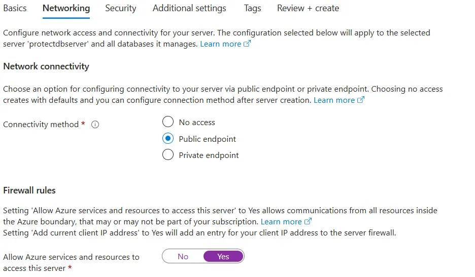
        
    - Select **“Default”** under Connection policy
        
        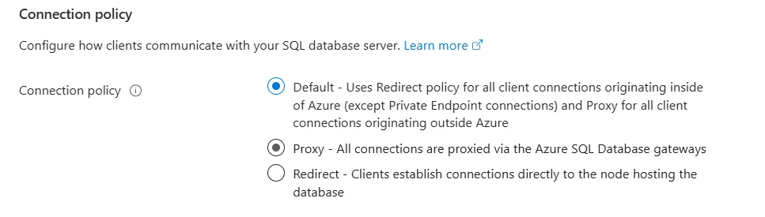
        

### Step 2: Add the Database as a Resource in PAM360

1. Log in to **PAM360** as an admin
2. Navigate to **Resources > Add Resource**
    - **DNS/IP Address**: Use your Azure SQL Server name
    - **Resource Type**: Select **MS SQL Server**
    - Leave other settings as default


### Step 3: Add the Admin Account

1. Add the admin account you created during Azure setup
2. Set the **default database** for this user (e.g., `protectdb`)
3. Enable:
    - ✅ **Password Reset**
    - ✅ **Session Recording SQL**


### Step 4: Configure Remote Password Reset

1. Enable and configure **Remote Password Reset**
2. Fill in the following:
    - **Instance Name**: Azure SQL Server name
    - **Port**: 1433
    - **MSSQL Admin Account**: Select the previously added admin user
        - This user will be used to **rotate and reset** passwords remotely
            
            
            

### Step 5: Connect and Validate

1. Use PAM360 to launch a session to your Azure SQL Database
2. You'll be logged in as the **admin user**, and default database will auto-load


### Step 6: Add a Test User to the Database

1. Switch to the `master` database and run the following SQL script to create a login:

```sql
CREATE LOGIN pamuser WITH PASSWORD = 'SecureP@ssword123!';
```

1. Switch to your **target database** (e.g., `protectdb`) and execute:

```sql
CREATE USER pamuser FOR LOGIN pamuser;
ALTER ROLE db_datareader ADD MEMBER pamuser;
ALTER ROLE db_datawriter ADD MEMBER pamuser;
```

Sadly we cannot discover automatically accounts for this database. PAM360 tries to discover accounts from the **`master` database**, but Azure SQL **does not allow querying server-level metadata** (like `sys.sql_logins`) the same way on standard SQL Server.

Unlike on-premise SQL Server, **Azure SQL** restricts access to these views — especially from within user databases or without elevated privileges.

You’ll need to **manually register each database user**.


### Step 7: Test Database Access

Use PAM360 to open a session and run the following query:

```sql
SELECT name FROM sys.databases;
```

You should see both `admin` and `pamuser` active.


### Step 8: Monitor Access with SQL Session Recording

1. Go to **Audit > Resource Audit** in PAM360
2. Review session recordings for SQL activity
3. Track executed queries and user behavior for compliance and accountability


### Conclusion

This use case shows how PAM360 enables **secure access control for cloud-hosted databases**:

- Full **integration with Azure SQL**
- **Session recording** and **audit trail** for transparency
- Centralized password management and **remote password reset**
- Manual account registration due to Azure limitations
- **Real-time monitoring** of database user activity

By integrating PAM360 with Azure SQL, your organization achieves **cloud-ready privileged access protection**—without compromising visibility or control.

For further security, integration access policies specifically related to databases would be the next logical step.

---

# 7. Monitoring and auditing

## 7.1 Audits

- Resource Audit
    - All activities related to privileged accounts and passwords, resources, resource groups, sharing, and password policies
    
    
    
- User Audit
    - All user operations, providing detailed tracking of user activities.
    
    
    
- Task Audit
    - Records of all scheduled tasks created and executed, providing detailed tracking of task executions
    
    
    
- User Sessions
    - Records of all operations performed by users during their active sessions, providing detailed tracking of user activities.
    - Can be viewed by selecting a particular user session during a specific date or within a specific date range
    - Administrators also have the option to terminate any active user session
    
    
    
- Recorded Server Connections
    - All the recorded remote sessions
    - You can search for the desired recorded sessions using details such as 
    resource name, account name, or time stamp
    - To view a recorded session,  click the **Play** icon beside the desired recording and use the **Seek** bar to skip parts of the session as needed.
    
    
    
- All logs are also stored locally, for more details and information, check the [following documentation](https://www.manageengine.com/privileged-access-management/help/logs.html)

## 7.2 Dashboards

- Password Dashboard
    
    
    
    | **Element** | **Explanation** | **Use Case** |
    | --- | --- | --- |
    | **Total Passwords** | Total count of privileged passwords stored in PAM360. | Gauge scale of privileged access landscape; verify that all critical systems are covered. |
    | **Expired Passwords** | Count of passwords past their expiry date. | Proactively rotate expired credentials to avoid access disruptions or security risks. |
    | **Policy Violations** | Passwords violating configured complexity or rotation rules. | Enforce internal security policies; identify and remediate weak or non-compliant credentials. |
    | **Conflicting Passwords** | Mismatches between PAM360-stored passwords and actual credentials on systems. | Prevent broken access flows or automation; detect unauthorised manual changes. |
    | **Password Distribution** | Visual categorisation of passwords by resource type (Windows, Linux, DB, etc.). | Analyse risk exposure; focus compliance checks on most represented system types. |
    | **Password Activity** | Log of recent password-related operations. | Trace actions for auditing; identify unusual behaviour such as frequent retrievals or unexpected edits. |
    | **Resource Audit – Live Feed** | Real-time log of password operations and resource access events. | Monitor current activity to respond quickly to anomalies, misuse, or access abuse. |
    | **Favorites and Recent** | Quick-access section for commonly or recently used credentials/resources. | Improve admin efficiency; simplify repetitive or daily access. |
    | **Active Privileged Sessions** | List of live sessions initiated via PAM360. | Enable live monitoring and, if needed, termination of sessions to mitigate threats or mistakes. |
- User Dashboard
    
    
    
    | **Element** | **Explanation** | **Use Case** |
    | --- | --- | --- |
    | **User Activity** | Overview of recent user actions (retrievals, check-ins, edits, etc.). | Track user behaviour and detect abnormal activity (e.g., users accessing new or unusual resources). |
    | **Role Distribution** | Breakdown of user roles in the system (Admin, Auditor, etc.). | Support access governance by identifying imbalanced privilege distributions. |
    | **Active User Sessions** | List of users currently logged into PAM360. | Live visibility into who is accessing the system, when, and from where. |
    | **User Audit – Live Feed** | Real-time activity log capturing user events such as logins, password actions, and settings changes. | Detect policy violations or insider threats as they happen. |
    | **Most Active Users** | Users with highest activity levels (e.g., number of sessions, retrievals). | Identify power users or potential overuse/abuse cases; helps in prioritising user reviews and support. |
- Keys Dashboard
    
    
    
    | **Element** | **Explanation** | **Use Case** |
    | --- | --- | --- |
    | **SHA-1 Certificates** | Lists all certificates using the outdated SHA-1 hashing algorithm, which is no longer considered secure. | Helps administrators identify certificates that need to be upgraded to SHA-256 or stronger, reducing vulnerability to spoofing and other cryptographic attacks. |
    | **1024 Bit and Smaller Keys** | Highlights RSA and other keys that are ≤1024 bits in length, which are highly susceptible to brute-force attacks. | Enables security teams to prioritise replacement of weak keys with stronger ones (e.g., 2048 or 4096-bit), aligning with best practices and compliance standards like NIST or PCI-DSS. |
    | **Last Rotation Failed** | Flags key rotation attempts that failed, which may leave critical keys unrotated and increase risk. | Prompts immediate investigation and corrective action to ensure key rotation processes are functioning as expected and reduce exposure to stale cryptographic material. |
    | **Keys Not Rotated in Last 30 Days** | Shows keys that haven't been rotated in over 30 days, potentially violating policy or increasing the attack surface. | Allows admins to schedule or enforce rotation of keys regularly, meeting internal policies or external compliance mandates, and avoiding long-term key reuse vulnerabilities. |
    | **Certificate Authority** | Displays details about certificates issued by different CA (Certificate Authorities) in the environment. | Helps organisations monitor CA trust chains, detect reliance on untrusted CAs, and manage internal vs external issuance, ensuring all digital identities are validated by approved authorities. |
    | **Certificate Expiry** | Provides expiry timelines for all certificates, enabling proactive renewal. | Prevents downtime or security warnings due to expired certificates; admins can schedule renewals in advance and automate alerts for expiring certificates. |
    | **License Details** | Shows usage stats of the PAM360 licensing model, including counts of SSL certs, SSH keys, PGP keys, and key stores. | Enables planning and scaling—admins can assess if they’re nearing license limits and plan upgrades or cleanups accordingly to optimise PAM360 usage. |
    | **Vulnerabilities** | Detects cryptographic vulnerabilities (e.g., weak cipher suites, poodle SSL, revoked certificates). | Security teams can act on flagged risks, running remediation efforts (e.g., disabling weak cipher suites or revoking compromised certs) to ensure system-wide cryptographic hygiene and reduce risk of exploitation. |
    | **SSH Key Summary** | Overview of SSH keys: total, unused, unique, or duplicated keys, helping assess key sprawl and hygiene. | Enables reduction of SSH key clutter, removal of orphaned keys, and enforcement of least-privilege principles by reviewing SSH key deployments and access paths. |
    | **Operation Audit** | Full audit trail of key and certificate events—generation, distribution, rotation, revocation, etc. | Ensures transparency and accountability in key life cycle management; supports internal audits, external compliance checks (e.g., ISO 27001, SOX), and forensic investigations in case of incident. |
- Security Dashboard
    
    
    
    | **Element** | **Explanation** | **Use Case** |
    | --- | --- | --- |
    | **Inactive Users** | Number of users who haven't logged in or used PAM360 in the last x days. | Helps identify and deactivate dormant accounts, reducing the attack surface and complying with account lifecycle policies. |
    | **Non-MFA Users** | Count of users not using Multi-Factor Authentication (MFA). | Highlights users with weaker authentication methods. Administrators can enforce MFA for better access security. |
    | **Non-Synchronized Users** | Users whose account credentials are not synchronized with external authentication systems (like LDAP/AD). | Ensures user directory integrity and reduces the risk of local-only credentials being exploited. |
    | **Users with Local Authentication** | Users logging in via local credentials instead of centralized identity providers. | Identifies users bypassing federated or directory-based authentication for better visibility and risk mitigation. |
    | **Security Hardening Score** | A visual percentage reflecting the overall security posture based on configured best practices. | Quickly assess how secure the PAM360 environment is; serves as a metric to guide future security improvements. |
    | **Security Assessment Posture – Server Tab** | A checklist of system-level configurations related to encryption, protocols, backup, key storage, and more. Icons indicate pass, warning, or failure. | Helps assess and guide compliance with secure deployment practices—e.g., TLS enforcement, key storage, HTTPS usage, and backup configuration. |

## 7.3 Reports

PAM360 offers a wide range of reporting features that help organizations maintain visibility, enforce compliance, and audit privileged access across users and systems. These reports are organized into several categories to suit operational, compliance, and executive needs.

**Password Reports** focus on the health and management of credentials. They allow administrators to review the full inventory of accounts, check if passwords comply with established policies, monitor password expiry, and track how passwords are being used within the organization. Additional reports help identify passwords that are unshared, not grouped under any resource, or out of sync with their corresponding systems. There are also insights into how password access control workflows are being used and whether any resources have been disabled.


**User Reports** provide visibility into user behavior and access patterns. You can quickly see which users have access to which resources, monitor individual user activity involving password operations, and detect users who are not assigned to any group—useful for tightening access controls and maintaining accountability.


**Custom Reports** give you detailed audit trails on specific actions, such as passwords accessed by users, approved or denied password requests, failed access attempts, password modifications, and even unauthorized application elevation events. These reports are ideal for forensic analysis and internal audits.


**General Reports**, like the Executive Report, offer a high-level summary of all password activities, access events, and policy compliance indicators—perfect for management or compliance officers who need a quick snapshot of the environment.


PAM360 provides a dedicated **Compliance Reports** section designed to help organizations demonstrate alignment with industry-specific security and privacy standards. These reports map PAM360’s features and controls to the corresponding clauses and requirements in major regulatory frameworks.

### Available Compliance Reports:

1. **PCI DSS Compliance Report**
    - Identifies violations in password management practices related to the **Payment Card Industry Data Security Standard (DSS)**.
    - Ideal for organizations handling cardholder data and needing to show adherence to PCI guidelines.
2. **ISO/IEC 27001 Compliance Report**
    - Maps PAM360's features to the **ISO/IEC 27001 standard**, particularly around access control (e.g., Clause A.9).
    - Helps security and compliance teams track conformance with information security management system (ISMS) controls.
3. **NERC-CIP Compliance Report**
    - Assists with meeting **North American Electric Reliability Corporation - Critical Infrastructure Protection (NERC-CIP)** requirements.
    - Covers specific clauses like **CIP-004-3a, CIP-005-3a**, and **CIP-007-3a** that deal with identity, access, and system security.
4. **GDPR Compliance Report**
    - Focuses on provisions in the **General Data Protection Regulation (GDPR)**.
    - Shows how PAM360 supports data subject rights and secures personal data, aiding in privacy assurance for European users.


## 7.4 **How to Generate a Compliance Report (e.g., ISO/IEC 27001)**

PAM360 makes it simple to generate compliance reports through a guided process:

1. **Navigate to the 'Compliance Reports'** section in the left-side menu.
2. Choose a desired framework, such as **ISO/IEC 27001**.
3. Click **Generate Report**.
4. A pop-up window will appear, allowing you to select:
    - **All Controls** or specific sub-controls (e.g., Control 9.1 to 9.4).
    - Configure a **Schedule** if you want the report to be generated periodically.
5. Click **Generate Report** or **Schedule Report** as needed.


Here is an example of a generated report :

[ISO27001Requirement-May_8_9_04_31.pdf](ISO27001Requirement-May_8_9_04_31.pdf)

All reports in PAM360 can be generated manually, customized to fit specific audit criteria, and scheduled for regular delivery—ensuring continuous monitoring and streamlined reporting for both operational teams and executives.

---

# 8. Comparison with Industry Leaders

Although PAM360 is a nice solution, it would be interesting to dive into other solutions, especially from the leaders in the market. We will go through a summary of the PAM solution capabilities of both CyberArk and BeyondTrust, and compare them with what ManageEngine PAM360 offers :

| Capability | CyberArk | BeyondTrust | ManageEngine PAM360 |
| --- | --- | --- | --- |
| **Target Customers** | Large enterprises | Mid-to-large enterprises | SMBs to mid-sized orgs |
| **Deployment Options** | Cloud/Hybrid/On-prem | Cloud/Hybrid/On-prem | On-prem + Cloud Support |
| **Credential Vault** | Enterprise-grade | Password Safe | AES-256 Vault |
| **Session Management** | Advanced | Risk-based | Recording only |
| **JIT Access** | Advanced + Analytics | Endpoint enforced | Basic policy-based |
| **DevOps Integration** | Full | Integrated | Basic |
| **Ease of Use** | Complex | User-friendly | Very accessible |
| **Pricing** | Premium | Competitive | Budget-friendly |

## **8.1 ManageEngine PAM360**

- **Pros:**
    - Affordable pricing suitable for small to medium businesses.
    - Comprehensive feature set covering credential, session, and certificate management.
    - User-friendly interface with intuitive dashboards.
    - Quick deployment with minimal setup complexity.
- **Cons:**
    - Limited advanced customization options compared to competitors.
    - Integration capabilities might be limited to ManageEngine's ecosystem.
    - Lacks some advanced features like machine identity security.

## **8.2 CyberArk**

- **Pros:**
    - Extensive industry coverage with strong compliance support.
    - Advanced security features including machine identity security.
    - Robust session management with real-time monitoring.
    - Broad integration with enterprise systems and cloud platforms.
- **Cons:**
    - High resource requirements and premium pricing.
    - Complex setup requiring technical expertise.
    - Limited support for containerized solutions like Kubernetes.

## **8.3 BeyondTrust**

- **Pros:**
    - Strong enterprise-level integration with various systems.
    - Real-time threat analytics and detailed audit trails.
    - Comprehensive credential and session management features.
    - Intuitive interface with customizable dashboards.
- **Cons:**
    - Complex for small businesses with limited IT resources.
    - Initial setup can be time-consuming.
    - May require dedicated personnel for ongoing management.

## **8.4 Summary**

- **ManageEngine PAM360** is ideal for small to medium-sized businesses seeking an affordable and comprehensive PAM solution with user-friendly features.
- **CyberArk** is best suited for large enterprises, especially in regulated industries, requiring advanced security features and extensive compliance support.
- **BeyondTrust** offers a robust solution for large enterprises with complex IT environments, providing strong integration capabilities and real-time analytics.

Your choice among these solutions should align with your organization's size, complexity, compliance requirements, and budget constraints.

Sources

[29 Best Privileged Access Management Solutions Reviewed In 2025 - The CTO Club](https://thectoclub.com/tools/best-privileged-access-management-solutions/)

[CyberArk vs. BeyondTrust: Which PAM Solution is Better? | StrongDM](https://www.strongdm.com/blog/cyberark-vs-beyondtrust)

https://hoop.dev/blog/top-5-cyberark-alternatives-for-enhanced-enterprise-security-2/

[CyberArk Privileged Access Manager vs PAM360 2025 | Gartner Peer Insights](https://www.gartner.com/reviews/market/privileged-access-management/compare/product/cyberark-privileged-access-manager-vs-pam360)

---

# 9. Conclusion - TBD

- *Summary of achievements*
- *Key takeaways from the implementation*
- *Potential next steps (SIEM integration, open-source options)*

---

TBD
